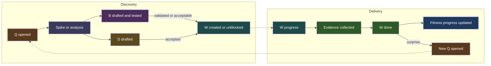
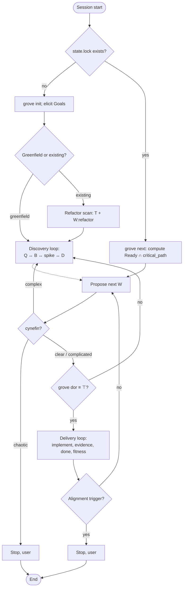

# Graph-driven reasoning over verified evidence

A dual-track, evidence-based workflow for AI agents. State lives in a single line-oriented lock file; the agent reads only what the current step demands. Designed to let weak agents go deep without hallucinating.

Core ideas (analogues in brackets):

- Discovery and Delivery run in parallel [Dual-Track Agile, Cagan].
- Every executable unit has explicit acceptance criteria before code is written [HDD, Definition of Ready].
- Long-lived design choices are first-class artifacts [ADR, Nygard].
- Open unknowns are first-class artifacts; agents declare them rather than pretend to know [Continuous Discovery; Cynefin].
- Refactoring uses a Mikado-style dependency graph distinguishing causation, sequencing, implementation, and inquiry.

## State lives in `.grove/state.lock`

Files inside `.grove/`:

- `state.lock`: the SINGLE source of truth. Line-oriented DSL. Carries a SHA-256 checksum. **Never edit this file by hand.** Any manual edit is detected on the next CLI call and blocks all work until `grove repair --confirm`.
- `index.md`: auto-generated dashboard plus mermaid graph. Regenerated on every mutate command. Manual edits are overwritten.
- `glossary.md`: the only file the agent edits directly (domain terms).
- `journal.log`: append-only JSON-lines journal. Mutation records carry the inverse ops behind `grove undo` and `grove stats`; gate, distill, undo, and DoR-refusal records are non-mutations. `grove undo` truncates the lines it reverts.

Per-node `w-NN.md`, `d-NN.md`, `q-NN.md`, `b-NN.md` files do NOT exist in this skill. All node bodies (acceptance criteria, hypotheses, evidence, ADR context, investigation logs) live as prose fields inside `state.lock`.

## User-level store

`~/.grove/` (overridable via `GROVE_HOME`) holds the project registry `projects.toml` (name, path, created, last_opened; human-editable, not checksummed) and, by convention, one independent subdirectory per project, each a normal grove project with its own lock. Locks never intersect: there are no live cross-lock references. Discoveries move between projects only by copy-with-provenance via `grove promote Y-NN --to=<project>` (D13); each copy starts its own staleness lifecycle in the target. Target a project with `--project=<dir|name>` or the `GROVE_PROJECT` environment variable; list the registry with `grove projects`.

## All access is through the `grove` CLI

```bash
alias grove='julia --project=/path/to/grove/packages/grove /path/to/grove/bin/grove.jl'
```

### Cheat sheet

```bash
grove init                              # bootstrap .grove/
grove next                              # propose the next W (Ready ∩ critical_path)
grove packet W-12                       # full execution context for W-12
grove add w --type=feature --cynefin=clear --goals=G-01 --title="…"
grove field W-12 ac add "User can sign in."
grove link Q-03 asks W-12
grove set W-12 status=progress          # guarded by DoR, WIP, blocks
grove evidence W-12 "tests green; abc123"
grove fitness W-12 G-01 +1
grove set W-12 status=done              # guarded by I₃
grove dor W-12                          # conjunct breakdown
grove path                              # critical path
grove check                             # all invariants; use in pre-commit
```

`grove next` returns the same content as `grove packet <ID>`, a self-contained markdown bundle covering the W, every linked decision, every `BChain` assumption, and the outcome of every blocking question. That bundle is the only context an agent needs.

## Reading order

This page is the minimal safe contract; the pages below are depth, opened when the task touches their topic (see [planning](#3-planning) §6). Full versions:

**Must-read on activation:**

1. [Formal model](#1-formal-model): nodes, edges, statuses, invariants I₁..I₁₃, DoR.
2. [Protocol](#2-workflow-protocol): workflow, cynefin gating, session start, discovery / delivery loops, alignment triggers.
3. [Planning](#3-planning): planning context lives in the lock, full node vocabulary, required fields, goal fitness.
4. [CLI](#4-cli-reference): full CLI reference.
5. [Evidence](#5-evidence-definition-of-done): DoD per work-item type.
6. [Rules](#6-rules): operational rules, merge protocol, pre-commit hook.
7. [Lockfile](#7-lockfile-specification): grammar; needed only for tooling outside the CLI.
8. [Typography](#8-typography): formatting rules for all prose fields, entity titles, and other text content. Must be followed consistently.
9. [Checklist](#9-quality-checklist): end-of-session quality gate.
10. [Diagrams](#10-diagrams): mermaid for dual-track, top-level workflow, palette.

## Hard constraints

- Never read or write `state.lock` directly. Always go through `grove`.
- Never bypass `grove dor`. If DoR is `⊥`, return to the Discovery loop.
- Never mark `done` without recording evidence via `grove evidence`.
- Never re-run discovery if `state.lock` already exists.
- If `cynefin = chaotic` on any node you touch, stop and escalate.
- Never put planning context into side markdown files; decisions, questions, and assumptions are D/Q/B nodes ([planning](#3-planning)).
- Never ship a plan of only G and W nodes; surface unknowns as Q/B and choices as D first.
- Never leave a goal without `fitness_kind` + `fitness_target` or a work item without full DoR fields at creation.

---

# 1. Formal model

## 1.1 Node taxonomy

Development state is the tuple:

```text
Σ ≜ (G, W, D, Q, B, T, Y, A, E)
```

| Set                | Symbol             | Meaning                                                           | ID prefix |
| ------------------ | ------------------ | ----------------------------------------------------------------- | --------- |
| Goals              | G                  | Outcome / requirement; has fitness function.                      | `G-NN`    |
| Work items         | W                  | Executable unit with DoR + DoD.                                   | `W-NN`    |
| Decisions          | D                  | ADR; long-lived design choice.                                    | `D-NN`    |
| Questions          | Q                  | Open unknown.                                                     | `Q-NN`    |
| Assumptions        | B                  | Falsifiable assumption with validation method and result.         | `B-NN`    |
| Artifacts (themes) | T                  | Grouping of related W (optional).                                 | `T-NN`    |
| Discoveries        | Y                  | Curated invariant distilled from process records; never archived. | `Y-NN`    |
| Areas              | A                  | Permanent scope skeleton above goals; owns goals; no lifecycle.   | `A-NN`    |
| Edges              | E ⊆ N × LabelE × N | Typed graph edges (§1.3).                                         | –         |

with N ≜ G ∪ W ∪ D ∪ Q ∪ B ∪ T ∪ Y ∪ A.

All nodes and edges are stored in `./grove/state.lock` (see [Lockfile](#7-lockfile-specification)). There are no per-node files.

## 1.2 Work item type

```text
type(w) ∈ { feature, refactor, bug, spike }
```

- **feature**: new capability; needs hypothesis (HDD) and resolved assumptions when discovery exposed uncertainty.
- **refactor**: structural change, behaviour preserved; needs root cause (causation edge from T).
- **bug**: defect in shipped behaviour; needs reproducible evidence.
- **spike**: investigation only; produces D, Q, or B, not production code.

## 1.3 Edge labels

```text
LabelE = { blocks, causes, implements, asks, tests, supersedes, produces, targets, distills }
```

| Label        | Domain → Codomain    | Meaning                                                            |
| ------------ | -------------------- | ------------------------------------------------------------------ |
| `blocks`     | N → W                | Predecessor must be terminal before successor may start.           |
| `causes`     | T → W (refactor/bug) | Root cause to symptom.                                             |
| `implements` | W → D                | Work item realises an accepted decision.                           |
| `asks`       | Q → N                | Open question is raised against the target node.                   |
| `tests`      | B → Q                | Assumption operationalises a question into falsifiable validation. |
| `targets`    | B → W                | Assumption is required by a work item (defines `assumptions(w)`).  |
| `produces`   | W → D ∪ Q ∪ B ∪ Y    | Work item (typically a spike) produced this record.                |
| `supersedes` | D → D, Y → Y         | New record replaces the old one.                                   |
| `distills`   | Y → D ∪ Q ∪ B        | Discovery distills content from this process record.               |

The graph (N, E) is acyclic on `blocks`. Cycles on other labels are allowed.

## 1.4 Status sets

```text
status(g) ∈ { unverified, partial, verified, declined }
status(w) ∈ { proposed, ready, progress, done, rejected, archived }
status(d) ∈ { proposed, accepted, rejected, superseded }
status(q) ∈ { open, deferred, answered, dropped }
status(b) ∈ { proposed, testing, validated, invalidated_acceptable, invalidated_blocking }
status(t) ∈ { open, done }   (derived per I₆; never set manually)
status(y) ∈ { proposed, active, stale, superseded }
status(a) = present   (structural; no lifecycle, never set manually)
```

## 1.5 Cynefin tag (mandatory on Q, B, and W)

```text
cynefin(n) ∈ { clear, complicated, complex, chaotic }
```

Drives agent behaviour ([Protocol](#2-workflow-protocol) §2.2). If `chaotic`, stop and escalate.

## 1.6 Core invariants

```text
I₁:  ∀ w ∈ W with status = progress, DoR(w) ≡ ⊤.
I₂:  ∀ w with type = spike ∧ status = done,
      produces(w) ⊆ D ∪ Q ∪ B  ∧  produces(w) ≠ ∅.
I₃:  ∀ w with status = done, ∃ ev ∈ Evidence, satisfies(ev, AC(w)).
I₄:  |{ w ∈ W : status(w) = progress }| ≤ WIP_LIMIT (default 2).
I₅:  ∀ (n₁, blocks, n₂) ∈ E, terminal⁺(n₁) before status(n₂) may transition to progress.
I₆:  ∀ t ∈ T, status(t) = done ⟺ ∀ w ∈ WI(t), status(w) ∈ { done, rejected, archived }.
I₇:  graph (N, E ∩ (· × {blocks} × ·)) is a DAG.
I₈:  ∀ q ∈ Q with cynefin(q) = chaotic, status transitions only via human.
I₉:  ∀ w ∈ W with type = feature, DoR(w) ⇒
      ∀ b ∈ BChain(w), status(b) ∈ { validated, invalidated_acceptable }.
I₁₀: status transition w → done is atomic with applying fitness deltas
      to each g ∈ goals(w) and re-deriving status(g). Either both succeed or
      neither does. The CLI rejects status=done unless deltas are staged
      in the same call (or pre-staged via `grove fitness` since the last
      status mutation of w).
I₁₁: ∀ w ∈ W with status = progress, the session that set it is the only
      session permitted to mutate w until terminal(w) or w leaves `progress`
      (e.g. `revert` or another guarded status change). Persisted as header
      attrs `session` and `session_at` (UTC); `check` rejects a missing token
      (`grove resume` adopts; see protocol §2.6).
I₁₂: ∀ y ∈ Y: (≥1 provenance edge: (w, produces, y) ∨ (y, distills, d/q/b))
      ∧ (surface(y) ≠ ∅ ∨ why(y) ≠ ∅) ∧ tags(y) ≠ ∅ (≥1 glossary term).
      `proposed → active` is refused while any conjunct fails; `stale → active`
      only via `grove revalidate` paid with a fresh anchor.
I₁₃: ∀ g ∈ G: ∃ a ∈ A with area(g) = a.id, recorded as the mandatory `area`
      field and enforced at creation (`grove add g --area=A-NN`); re-partition
      via `grove set G-NN area=A-NN`. An area-less goal in the lock is a
      violation, never silently repaired.
```

with terminality:

```text
terminal(w ∈ W)  ⟺ status(w) ∈ { done, rejected, archived }
terminal⁺(g ∈ G) ⟺ status(g) = verified            -- strict for blocks-edges
terminal(g ∈ G)  ⟺ status(g) ∈ { verified, declined }
terminal(d ∈ D)  ⟺ status(d) ∈ { accepted, rejected, superseded }
terminal(q ∈ Q)  ⟺ status(q) ∈ { answered, deferred, dropped }
terminal(b ∈ B)  ⟺ status(b) ∈ { validated, invalidated_acceptable, invalidated_blocking }
terminal(t ∈ T)  ⟺ status(t) = done
terminal(y ∈ Y)  ⟺ status(y) = superseded      -- stale stays readable, contributes nothing
terminal(a ∈ A)  ⟺ ⊥                            -- areas have no lifecycle
```

`terminal⁺` is the strict variant used for `blocks` edges: a `declined` goal
does not unblock dependents. Other relations use the lax `terminal`.

```text
assumptions(w) ≜ { b ∈ B | (b, targets, w) ∈ E }
BChain(w)      ≜ assumptions(w) ∪ { b ∈ B | ∃ q, (q, asks, w) ∈ E ∧ (b, tests, q) ∈ E }
produces(w)    ≜ { n ∈ D ∪ Q ∪ B ∪ Y | (w, produces, n) ∈ E }
goals(w)       ≜ as recorded in `goals` field of w
WI(t)          ≜ { w ∈ W | theme(w) = t }
```

## 1.7 Definition of Ready

```text
DoR(w) ≜
  (goals(w) ≠ ∅) ∧
  (AC(w) ≠ ∅) ∧
  (∀ q ∈ asks(w), status(q) ∈ { answered, deferred, dropped }) ∧
  (type(w) = feature ⇒ ∀ b ∈ BChain(w), status(b) ∈ { validated, invalidated_acceptable }) ∧
  (∀ g ∈ goals(w), contributes_to_fitness(w, g) ≠ ⊥) ∧
  (evidence_strategy(w) ≠ ∅) ∧
  (type(w) = feature ⇒ hypothesis(w) ≠ ⊥) ∧
  (type(w) = bug ⇒ repro(w) has a non-empty prose line) ∧
  (type(w) = spike ⇒ exit(w) has a non-empty prose line) ∧
  (type(w) = refactor ⇒ ∃ t ∈ T, ¬archived(t) ∧ (t, causes, w) ∈ E) ∧
  (cynefin(w) ≠ chaotic) ∧
  (requires_coverage(w) ∧ type(w) = feature ∧ cynefin(w) = complex ⇒ coverage(w) ≥ θ)
```

`grove dor <ID>` evaluates DoR conjunct-by-conjunct.

The coverage conjunct is opt-in: it is active only when some `g ∈ goals(w)` or
`theme(w)` carries the header attr `requires_coverage`: `true` means θ = 0.5,
a float in `(0,1]` sets θ directly, and several carriers resolve to the maximum
θ. `coverage(w)` is the share of w's declared `surface` (the estimate recorded
via `grove add w --surface` or `grove field W-NN surface add`) covered by the
union of surfaces of **active** discoveries; `proposed` / `stale` /
`superseded` Discoveries and `surface=none` Discoveries contribute nothing. The conjunct
applies only to `feature` work in the `complex` domain; every other shape
passes vacuously. Spikes need no exemption: they are non-feature, so the first
spike in an uncovered area stays the sanctioned way coverage is created (cold
start). DoR keeps its pin-at-transition semantics: a later staleness event
blocks new `progress` transitions but never breaks an in-flight W.

## 1.8 Timestamps

Every node carries `t_created` and `t_updated` (RFC-3339, UTC, second precision).
Every edge carries `t_created`. The CLI assigns and bumps these; agents do not
set them. They are used by `grove log`, `grove diff`, and metric exports.

## 1.9 Type-specific obligations

`grove dor` implements the `type(w)` conjuncts in §1.7 (`hypothesis` + BChain for `feature`;
`repro` / `exit` prose fields for `bug` / `spike`; materialised `T` with `(t, causes, w)` for
`refactor`). Further norms (e.g. spike vs production code, failing-test-first for bugs) are
protocol guidance, not additional CLI conjuncts unless recorded in AC / evidence_strategy.

`repro` and `exit` are first-class prose fields on `w` (see lockfile §6.5).

## 1.10 Areas

An area (kind `a`) is a permanent scope stratum above goals: the skeleton `A`
sits next to the content and answers "where it belongs", never "what is known"
(design D14). Areas carry a fixed `present` status, have no lifecycle, and are
never archived; an area whose goals have all left is a valid dormant scope and
stays as the collapsed stratum.

An area owns goals: every `g` carries a mandatory `area: A-NN` field, required
at creation (`grove add g --area=A-NN`) and movable via `grove set G-NN
area=A-NN` (I₁₃). `w` and `t` carry no area field; their areas are projections,
`areas(w) = union(areas(goals(w)))`, and a theme's areas derive from its
members the same way. `y` carries no area field either: Discovery relevance to a
scope is a pure function of state, never a declared residence.

The anchor sets of an area are derived mechanically:

```text
surface(a) ≜ declared surface on a ∪ ⋃ declared surface(w) over the area's work
tags(a)    ≜ ⋃ tags over the area's goals and their work items
nodes(a)   ≜ the area's non-archived goals ∪ their work items
             ∪ { q, b, d linked by any edge to those work items }
```

Attribution of content to an area comes in two tiers over these sets:

- **Soft tier** (render, per-area C/V): the Discovery relevance predicate of the
  packet (surface ∩ ∨ tags ∩ ∨ cone ∩) applied to the area's anchor sets.
  Only `active` Discoveries count; `stale` contributes zero. It is a relevance view,
  not a partition: a W or Discovery touching two areas counts in both, a W without
  goals counts in none, and the project totals in Content health stay primary.
- **Hard tier** (reserved for gates, not yet consumed by any gate): surface ∩
  alone. A Discovery is a coverage donor for area a iff `surface(Discovery) ∩ surface(a) ≠
∅`; tags ∩ and cone ∩ never feed a gate (D14).

The dashboard renders one row per area (including dormant ones) under
**Areas**, restricting the Content health components to `nodes(a)` and adding
the area's soft-attributed active Discoveries to C.

---

# 2. Workflow protocol

Two loops run concurrently, not as phases. Either may run in any session. See diagram in [diagrams/dual-track.md](#dual-track-loops) and the top-level flow in [diagrams/workflow.md](#top-level-session-workflow).

## 2.1 Cynefin-driven mode selection

Before doing anything on a node, the agent classifies it.

```text
cynefin(n) = clear        → execute directly; no spike, no Q needed.
cynefin(n) = complicated  → read code or docs, write plan, execute.
cynefin(n) = complex      → spike with explicit exit criteria; outcome ∈ {D, Q, B}.
                            Production code allowed only AFTER spike closes.
cynefin(n) = chaotic      → STOP; escalate to user; do not write code.
```

## 2.2 Session start protocol

**If `.grove/state.lock` exists:**

1. Run `grove status`. If the previous session left a W in `progress` owned by a stale session token (see §2.6), surface it first; do not advance to `grove next` until the user resolves it.
2. Run `grove next`. The CLI returns either an execution packet for a single proposed `W-NN` (chosen from `Ready ∩ critical_path`) or a structured "no-ready" diagnostic.
3. Confirm with the user only if any of: (a) alignment trigger from §2.5 is live, (b) `grove next` returned a fallback outside the critical path, (c) the proposed W's cynefin = `complex`. Otherwise proceed silently.
4. Do not re-run discovery if state exists.

**If `.grove/state.lock` does not exist:**

1. Run `grove init`. This creates `.grove/state.lock`, `.grove/index.md`, and `.grove/glossary.md`.
2. Ask the user for top-level outcome(s) and their scope partition. Create areas via `grove add a --title=…`, then `G-NN` rows via `grove add g --title=… --area=A-NN --fitness-kind=… --fitness-target=…`.
3. For each G, decide track:
   - **greenfield**: start the Discovery loop (impact map, then Q / B / D / W).
   - **existing code**: start a refactor scan (creates `T-NN` and `W:refactor` items).

The agent never reads `state.lock` directly. All reads go through `grove` ([cli.md](#4-cli-reference)).

## 2.3 Discovery loop

1. Open `Q-NN` with cynefin tag and exit criteria via `grove add q`.
2. If `complicated`, investigate via reads only; write outcome via `grove field Q-NN outcome add "…"`.
3. If the unknown affects whether a `feature` W should exist or how it should be scoped, open `B-NN` with a falsifiable assumption, validation method, and acceptance threshold.
4. If `complex`, open W with `type=spike`; produce D, Q, or B only.
5. When Q closes, either new B (answer needs validation), new D (a choice was made), new W (action follows), or `dropped` with reason.
6. When B closes as `validated` or `invalidated_acceptable`, run `grove dor` on every dependent W. When B closes as `invalidated_blocking`, revise or reject the dependent W.

## 2.4 Delivery loop

1. `grove next` to pick `w ∈ Ready`.
2. Verify `grove dor W-NN` reports ⊤. If not, return to Discovery on the missing conjunct. Never override DoR silently.
3. `grove packet W-NN` returns the self-contained execution packet (W body + linked D + B + Q.outcome + DoR breakdown). This is the only context the agent needs.
4. `grove set W-NN status=progress` (claims the session token, see §2.6).
5. Implement; collect evidence per strategy.
6. Stage fitness deltas: `grove fitness W-NN G-NN <delta>` for every linked goal (use `0` for enabling work and add a `why` note).
7. `grove evidence W-NN "…"` records evidence.
8. `grove set W-NN status=done`. The CLI atomically (I₁₀): verifies I₃ evidence, applies the staged fitness deltas, re-derives `status(g)` for each linked goal, derives `status(t)` for the theme (I₆), and auto-runs `grove render`. If any sub-step fails, the whole transition is rolled back.
9. `status(g)` re-derivation:
   - `verified` iff fitness function satisfied.
   - `partial` iff progress changed but threshold not met.
   - `unverified` iff no measured progress.
   - `declined` only by explicit user decision.
10. If a Goal becomes `verified`, the CLI prints a **distillation hint** (lazy distill; suppress with a `notes` line containing `--distill-deferred`). Distillation is mandatory before archiving, but the artifact is not: run `grove distill G-NN` for the worksheet (validated B / answered Q / accepted D in the goal's mass, each with a `grove add y --from=…` skeleton) and create Discoveries for what is worth keeping, or attest the empty case with `grove distill G-NN --null`. `grove archive G-NN` refuses until ≥1 Discovery is provenance-linked into the goal's exclusive mass **or** a null-distill attestation exists for the goal.

## 2.5 Triggers for user alignment

Stop ONLY when one of these holds:

```text
align ⟺
  (∃ q ∈ Q, cynefin(q) = chaotic) ∨
  (∃ b ∈ B, status(b) = invalidated_blocking) ∨
  (∃ w ∈ W, status(w) = done ∧ significant(w)) ∨
  (∃ g ∈ G, status(g) = verified) ∨
  (Ready = ∅ ∧ ((∃ q ∈ Q, status(q) = open) ∨ (∃ b ∈ B, status(b) ∈ { proposed, testing })))

where significant(w) ⟺
  (∃ d ∈ D, (w, implements, d) ∈ E ∧ status(d) = accepted) ∨
  (w lies on the current critical path) ∨
  (type(w) = refactor) ∨
  (type(w) = spike ∧ (cynefin(w) = complex ∨ |produces(w)| ≥ 1 with new D))
```

Trivial spikes (cynefin=complicated, no new D) do not trigger checkpoints.

## 2.6 Session tokens and interrupted work

Every `grove set W-NN status=progress` records a session token as the `session`
header attr and stamps `session_at` (RFC3339 UTC). The default token is
deterministic from the worktree path and host env (`COMPUTERNAME`/`HOSTNAME`/`HOST`);
override with `GROVE_SESSION` or each CLI's `--session=<token>`.
Subsequent mutations of that W require the same effective token.

`grove resume`, `grove handoff --to=…`, and `grove revert` adjust the claim (see
HELP). Undo restores prior `session`/`session_at` snapshots from the journal.

When `grove status` finds a `progress` W with a stale token (different session,
or session marker `> 24h`), it reports:

```text
W-12 progress (stale: session abc123, last touch 2d ago)
options:
  grove resume W-12       -- adopt the token in this session
  grove revert W-12       -- back to ready, discards progress notes
  grove handoff W-12 --to=<token>   -- transfer ownership
```

The agent MUST surface this before running `grove next`. Two sessions cannot
hold `progress` on the same W; the CLI rejects concurrent claims.

## 2.7 Checkpoint template

```text
Checkpoint. Reason: [trigger].
Done since last checkpoint: [W-NN, …].
Open: [Q-NN, …]; Proposed decisions: [D-NN, …].

Next options:
  1. [Most logical action].
  2. [Alternative].
  3. Your call.
```

---

# 3. Planning

How to turn an intention into grove state. Applies whenever you create or reshape goals and work items, before any `status=progress` happens.

## 1. Planning context lives in the lock, never in markdown files

Every artifact of planning - a design choice, an open question, a hypothesis, a risk - is a grove node, not a paragraph in a side document. The repo's own history is the precedent: `docs/plans/` and `docs/roadmap.md` were retired precisely because their content moved into D/Q/W records (see D-05 to D-09, Q-03, Q-04 in this project).

If you catch yourself drafting a plan as a markdown file, stop and decompose it into nodes instead:

| You were about to write         | Create instead                                                                    |
| ------------------------------- | --------------------------------------------------------------------------------- |
| "We choose A over B because..." | `grove add d` with `context`, `options`, `decision`, `consequences`, `validation` |
| "We don't know whether X..."    | `grove add q` (+ `asks` edges to the nodes it blocks)                             |
| "We believe Y is true..."       | `grove add b` with a validation method (+ `targets` / `tests` edges)              |
| "Open question for later..."    | `grove add q` (deferred is a status, not a file)                                  |

The only exception is a document the user explicitly asked for. Even then, the operative decisions belong in D records; the document is a view, not the source.

## 2. Use the full node vocabulary

The protocol technically runs on G and W alone. That is a license to be lazy, not a design. A plan containing only goals and work items is a smell: it means unknowns were swallowed, choices went unrecorded, and hypotheses will be re-tested or silently trusted.

Node selection:

- **A (area)**: the permanent scope skeleton. Create rarely, once per durable product area; every goal hangs under exactly one (I13).
- **G (goal)**: an outcome with a fitness function. Never a task list.
- **W (work item)**: the smallest executable unit with its own acceptance criteria.
- **Q (question)**: an open unknown. If planning cannot proceed without the answer, link `asks` to the blocked node - the CLI will gate it for you.
- **B (assumption)**: anything you currently treat as true without having checked: performance, compatibility, user behavior, external API shape. Give it a validation method and let it become `validated` or `invalidated_*` instead of folklore.
- **D (decision)**: a long-lived design choice. Once accepted it is immutable; it can only be superseded with a recorded rationale. This is where architectural reasoning lives permanently.
- **T (theme)**: optional grouping when a goal's work items cluster.
- **Y (discovery)**: not created during planning; it arrives later through distillation or `produces` from a spike.

Heuristics: "we think but haven't verified" -> B. "we don't know and it blocks" -> Q. "we picked one and it must stay picked" -> D. "we will need this grouping in the UI" -> T.

## 3. Required fields: DoR is the floor

For every work item before it becomes `ready`:

- `title` - a concrete outcome, not a topic.
- `goals` - at least one G-NN link.
- `type` and `cynefin` - honest classification; `chaotic` means stop and escalate to the human.
- `ac` - measurable acceptance criteria; each one checkable by a test, a command, or a screenshot, never by adjectives.
- `hypothesis` - why this approach should work.
- `evidence_strategy` - how you will prove the AC at close time.
- `fitness` - a staged delta for every linked goal (`grove fitness W-NN G-NN +N`).
- `blocks` edges - wherever sequencing actually matters.

`grove dor W-NN` must be `⊤` before `status=progress`; the CLI refuses otherwise. Fill the fields at creation, not at claim time.

For every goal at creation:

```bash
grove add g --area=A-NN --title="..." --fitness-kind=count --fitness-target=N
# fitness_target e.g. the number of planned work items
```

`fitness n/a` is legitimate only as a deliberate `fitness_kind=manual` decision. `add g` refuses a missing fitness specification outright (pass `--fitness-kind` with `--fitness-target` for `count` / `metric` / `ratio`, or `--fitness-kind=manual`); the legacy `--fitness="…"` label is retired (writes rejected), and the `set` / `field` backfill above no longer works.

## 4. Planning workflow

1. **Understand the intention.** Restate it as one sentence; if it splits into unrelated parts, those are separate goals.
2. **Anchor scope.** Pick or create the area (`grove list a`, `grove add a`).
3. **Create the goal with fitness** (section 3). The fitness target should be derivable from the decomposition you are about to do.
4. **Surface the unknowns first.** Before writing any W, list what you do not know and what you are assuming - those become Q and B nodes with their edges, because they shape the decomposition.
5. **Record the choices.** Any "we do X, not Y, because Z" becomes a D node while the reasoning is fresh.
6. **Decompose into work items** with full DoR fields (section 3) and `blocks` edges for real dependencies.
7. **Sanity-check.** `grove ready` shows the executable set; `grove dor` on anything that should be ready; `grove path` for the critical chain. Then present the plan to the user before starting.

## 5. Reasoning stays in your context; the lock stores conclusions

Deliberate as long as you need - but what lands in the lock is the compressed outcome, never the deliberation. Fields are atomic facts: one acceptance criterion per `field ... ac add`, one sentence per hypothesis line, no essays. Reasoning behind a choice concentrates in its D node (`context`, `options`, `decision`, `consequences`) and stays compact there too. Evidence at close time is numbers, files, and hashes ("workspace tests 301/0, desktop 121/0, screenshot X"), not a narrative of what you tried.

Practical serialization:

- Think the whole plan through in-context first, then write it down node by node. One batched shell call per node carries everything (`add` + all `field` lines + `fitness`), and one call can chain several nodes with `&&`.
- Never dump your reasoning into a field "for completeness". If a fact does not change what a future agent does, it does not belong in the lock.
- Length is not a workaround trigger: dozens of small CLI calls are normal and cheap compared to re-reading state; `grove packet` / `grove next` exist precisely so you never re-read the lock to plan.

## 6. Reading this skill

`index.md` is the minimal safe contract - it is short by design and complete for operation. The other pages are depth, not prerequisites for every action: open them when the task actually touches their topic. `cli.md` is a reference, not a tutorial; when unsure of a command's shape, run it - every refusal (`add g: --area is required`, `DoR ≢ ⊤; see grove dor W-NN`) is a precise instruction. The CLI's invariants are the last line of defense: partial reading degrades process quality, never state integrity.

---

# 4. CLI reference

Invocation: `grove <command> [args...]`.

The CLI reads and writes `.grove/state.lock` and `.grove/index.md` under a project root. Root resolution, first match wins: `--root=<path>` (explicit path, no name lookup; the root must contain or will contain `.grove/`), then `--project=<dir|name>`, then the `GROVE_PROJECT` environment variable (both take an existing directory or a registry name, unknown names exit 5), otherwise a walk-up from the current working directory to the first ancestor containing `.grove/state.lock` (fallback: the cwd itself).

## 3.1 Exit codes

| Code | Meaning                                               |
| ---- | ----------------------------------------------------- |
| 0    | Success.                                              |
| 1    | Generic error (bad args, file missing).               |
| 2    | Lock checksum mismatch. Use `grove repair --confirm`. |
| 3    | Invariant violation (`grove check`).                  |
| 4    | Guard failure (DoR, WIP, evidence missing, etc.).     |
| 5    | Not found (unknown ID).                               |

## 3.2 Read commands

**`grove status`:** session-aware overview. Lists: stale-token `progress` W's
(see [protocol §2.6](#26-session-tokens-and-interrupted-work)),
open alignment triggers (§2.5), invariant warnings short of full check.
Run this first in every session.

**`grove ready`:** list work items ready to start. Sorted: critical-path members first, then by descending downstream-blocks count. Output is one line per W: `W-NN  <title>  [crit]`.

**`grove next`:** single proposed W from `Ready ∩ critical_path`. Falls back to any `Ready` member if the intersection is empty. Prints the same packet as `grove packet <ID>` (see below).

**`grove packet <W-NN>`:** execution packet. Self-contained markdown bundle:

- The W record (header + all fields, prose rendered as markdown).
- Every `D-NN` linked by `implements`.
- Every `B-NN` in `BChain(W)`.
- The `outcome` of every `Q-NN` linked by `asks`.
- A DoR breakdown (same as `grove dor`).

`--cone` appends multi-hop structural context on `blocks` (output-only; no lockfile
change). Horizon: `--cone-depth=N` (BFS hops, default 4), `--cone-max=N` (node cap,
default 50). Sections:

- `## Contraction order`: backward cone in topological order: `1. W-NN  status  title`.
- `## Forward cone (impact)`: blast radius, same columns, unordered.
- `## Fragility`: per goal, vertex-disjoint `blocks`-paths G→W: `G-NN: k disjoint blocks-paths`, `G-NN: 1 (brittle)`, or `G-NN: no blocks-path`.
- `## Relevant discoveries`: only when non-empty.
- `> cone truncated (depth=N, max=M)`: final line when the horizon cut the cone.

JSON adds a `cone` object: `backward`, `order`, `forward` (id arrays), `fragility`
(`[{ goal, paths }]`), `relevant_discoveries`, `truncated`, `depth`, `max`.

This is the only context the agent needs to implement the W.

**`grove deps <ID>`:** transitive predecessors on `blocks`. One ID per line, in topological order.

**`grove impact <ID>`:** transitive successors on `blocks` (what does this unblock?).

**`grove path`:** critical path: longest chain of unfinished W on `blocks`, head to tail.

**`grove dor <W-NN>`:** DoR conjunct breakdown:

```text
W-12 DoR:
  ⊤  goals(w) ≠ ∅                      → G-01
  ⊤  AC(w) ≠ ∅                          → 2 entries
  ⊤  ∀ q ∈ asks(w), q terminal          → Q-03 (answered)
  ⊥  BChain validated                   → B-01 testing
  ⊤  fitness deltas set                 → G-01=+1
  ⊤  evidence_strategy ≠ ∅
  ⊤  hypothesis ≠ ⊥
  ⊤  repro(w) ≠ ∅                    → (non-bug)
  ⊤  exit(w) ≠ ∅                     → (non-spike)
  ⊤  (T, causes, w) via materialised T → (non-refactor)
  ⊤  cynefin ≠ chaotic                  → clear
result: ⊥
```

**`grove show <ID>`:** pretty-print one record.

**`grove list <kind> [--status=…] [--cynefin=…]`:** kinds: `w`, `d`, `q`, `b`, `g`, `t`, `y`, `a`. Tabular output.

**`grove graph`:** print the mermaid block to stdout.

**`grove diff [--since=<git-ref>]`:** structured diff of `state.lock`
between the current working copy and `<git-ref>` (default `HEAD`). Output
groups changes by record kind and shows added / removed / changed nodes and
edges, ignoring pure reordering. Designed for PR review.

**`grove projects`:** table of the project registry, one tab-separated row per
project: `name`, `path`, `last_opened`. The registry lives at
`~/.grove/projects.toml` (the user-level store is `~/.grove/`, overridable via
the `GROVE_HOME` environment variable). It is a human-editable convenience
index, not state, and is not checksummed: every CLI invocation whose resolved
root holds `.grove/state.lock` (and every `init`) upserts its row. `name`
defaults to the directory basename, suffixed `-2`, `-3`, ... when another path
already owns it; `created` is preserved across upserts, `last_opened` is
refreshed. A missing registry reads as empty; a malformed one prints a stderr
warning and registry features degrade gracefully, never crash a command.

**`grove log [<ID>] [--limit=N]`:** newest-first merged timeline from node/edge
`t_created`/`t_updated` attrs and `.grove/journal.log` (one tab-separated row per
source; journal rows use middle field `journal`). An `<ID>` filter also matches
inverse payloads in journal records (so IDs only referenced there still work).
`--limit=0` disables the cap.

**`grove gate [--theta=N] [--n=N]`:** report-only distillation gate (design D5/D6,
phase 0). Computes the structural differential since the last gate record:
treewidth of the active graph (min-fill upper bound) and its delta, W→done
transitions since baseline (`due: true` when count ≥ `--n`, default 5), then the
mechanical surprise signals as `would distill` candidates:

- `- overflow W-NN: <paths>`: actual git surface (files touched by commits
  since the baseline whose subject names the exact id `W-NN`; one batched
  `git log --name-only` scan per gate run) minus the W's declared `surface`
  field; shown when the overflow exceeds `--theta` (default 0). Empty when git
  is unavailable or no commit mentions the W.
- `- invalidated B-NN: <title>`: B that moved to `invalidated_*` since baseline.
- `- accepted D-NN: <title>`: D accepted since baseline.

**Report-only:** `gate` never writes `state.lock` and never creates Discovery nodes
(`grove add y` / `grove distill` perform the actual distillation). Its one
persistent write is a gate record appended to `.grove/journal.log`
(`{"v":1,"ts":…,"cmd":"gate","inv":{"op":"gate","tw":N,"dones":N,"empty":bool}}`);
an empty diff leaves a null record (`"empty": true`) for audit. Gate records are
non-mutations: `grove undo` skips them (never inverts, never truncates) and
`grove log` shows them plainly.

**`grove triage`:** read-only discovery recommender (design D12). Ranks every
non-terminal W by where discovery effort is most needed, from mechanical
signals only. One tab-separated row per W, columns `W  cov  χ  fragile
suggestion`: `cov` is the share of the W's declared `surface` covered by
_active_ Discovery surfaces (`0.00` when none declared), `χ` counts open Q among
`asks(w)` + BChain entries not yet `validated` / `invalidated_acceptable` +
failed DoR conjuncts, `fragile` is `yes` when any goal has ≤ 1 vertex-disjoint
`blocks`-path into the W. Sorted by coverage ascending, then χ descending,
then id. The suggestion is the first matching rule: declare surface → spike to
create coverage → resolve open Q/B and DoR gaps → add a redundant path
(blocks) → deepen coverage → ready to deliver. Empty project prints
`triage: no open work`. **Advisory only (D12):** triage never feeds
`grove next`, never gates an invariant, and persists nothing: no lock write,
no journal record.

**`grove check`:** run all invariants I₁..I₁₃ plus orphan-edge, edge-type, and Discovery decay checks; the lock checksum is verified on load. Exit code 0 / 2 / 3 as listed in §3.1.

**`grove stats`:** read-only telemetry computed from `.grove/journal.log` plus the
current lock; never writes the lock, the journal, or the index. Sections: cycle
time per cynefin class (ready to done, from status intervals reconstructed
backward through journal inverse records), DoR (rejection events total and per
node, progress entries, first-pass rate, and a first-pass split: progress
entries with no prior reject vs rejects followed by q/b/y churn
(`reject_discovery`) vs plain rejects, plus the discovery share of post-reject
entries), bets (entries into `validated` /
`invalidated_acceptable` / `invalidated_blocking`, ratio), discovery (stale
entries, revalidations, gate runs, empty gate runs, and gate overflow /
invalidated events), undo
(events, undone steps, undos per 100 mutations), audit (commands per journal
`session` token - count, per-session commands, mean/median/max; records
predating the key bucket as `unknown`. Checkpoint latency in hours, two series:
`dor_reject` to the next progress entry of that W, and Discovery proposed to
active. Post-approval invalidation: ever-`validated` B that later held an
invalidated status, count / denominator / rate), rework (per W: DoR reject
counts, split into covered vs uncovered by intersection of the W's declared
`surface` with currently active Discovery surfaces; undo events stay global
because undo drops journaled lines), distill yield (per archived goal: `real`
when a Discovery `distills` into the goal's exclusive archive pool, `null`
when only a null-distill attestation exists, else `none`), surprise
(invalidated B + gate overflows per done W), a surprise series (per done W,
chronological: surprise events since the previous done W, and the replayed C
value at that ts), a `gates` array with one row per gate record
(oldest first: treewidth, dones, empty flag, overflow events, overflow path
total, invalidated events; path total is null on legacy records without
counts), and a C/V series (V as in the Content health dashboard, including
uncovered surface) replayed backward over mutation
records (with a replay-failure count). Missing journal reads as empty;
unparseable or inconsistent records are tolerated and counted, never fatal.
Journal record kinds that feed it: `dor_reject` (appended when the DoR guard
refuses `status=progress`, with the failed conjunct labels in `missing`),
`undo` (appended after a successful undo, with `steps`), gate records (with
`overflows` / `invalidated` id lists and per-W `overflow_counts`), and
`archive` (goal id plus archived id list); all four are non-mutations, skipped
by `grove undo`. Every new record carries a top-level `session` key with the
writing command's effective session token.

**`--json` on read commands:** every read command in §3.2 prints **one JSON object** on stdout (UTF-8) instead of the human-oriented text. Keys always include **`command`** (string, same as the subcommand). Most mutate commands ignore `--json`; `add y`, `distill`, `revalidate`, and `glossary rename` emit a small JSON payload. Exit codes are unchanged; for **`check`**, failures still return **3** with **`"ok": false`** and an **`errors`** array in the JSON body (no duplicate error lines on stderr). Schema details: §3.4.1.

## 3.3 Mutate commands

**All mutate commands** re-serialize the lock with a fresh checksum and call `render` implicitly.

**`grove init`:** creates `.grove/state.lock`, `.grove/index.md`, `.grove/glossary.md`. Idempotent: refuses if the lock already exists.

Optional allocation tuning (persisted once in the optional `# @grove-id stride=…` lock comment; see [§6.1 Lockfile envelope](#61-file-envelope)):

- `--id-stride=<N>` (default `1`): additive gap between successive numeric suffixes (`N≥1`).
- `--id-offset=<K>` (default `1`): first suffix when a family allocator is empty (`K≥1`).
- `--id-width=<W>` (default `2`, or bumped to ≥`3` when stride/offset are non-default without an explicit `--id-width`): minimum digit padding for new IDs (`W≥2`).

**`grove renumber <ID> --to=<NEW-ID>`:** rewrites one record ID and every structured reference (`edges`, structural list fields keyed by IDs, `:fitness` map keys against goals, `:goal`/`:work-items` payloads, `:theme`, etc.). Refuses when the token appears verbatim in prose on **any done** `w` (`evidence` field), signalling that downstream consumers may have anchored on the exported string; resolve manually ([merge protocol](#merge--rebase-protocol)).

**`grove add <kind> [...]`:** kind ∈ `g w d q b t y a`.

| Kind | Required flags                                                                                                                                    | Optional                                                                                                        |
| ---- | ------------------------------------------------------------------------------------------------------------------------------------------------- | --------------------------------------------------------------------------------------------------------------- |
| `g`  | `--title="…"`, `--area=A-NN`, fitness spec (`--fitness-kind=count\|ratio\|boolean\|metric\|manual`)                                               | `--fitness-target=…` (required for `count` / `metric` / `ratio`), `--status=unverified`                         |
| `w`  | `--title="…"`, `--type=feature\|refactor\|bug\|spike`, `--cynefin=…`                                                                              | `--goals=G-01,G-02`, `--theme=T-01`, `--surface=p1,p2` (declared estimate, feeds coverage), `--status=proposed` |
| `d`  | `--title="…"`                                                                                                                                     | `--supersedes=D-01`, `--status=proposed`                                                                        |
| `q`  | `--title="…"`, `--cynefin=…`                                                                                                                      | `--targets=W-01`, `--status=open`                                                                               |
| `b`  | `--title="…"`, `--cynefin=…`                                                                                                                      | `--tests=Q-01`, `--targets=W-01`, `--status=proposed`                                                           |
| `t`  | `--title="…"`                                                                                                                                     | `--status=open`                                                                                                 |
| `y`  | `--title="…"`, `--tags=<t1,t2>` (≥1 glossary term), `--from=<W-NN\|D-NN\|Q-NN\|B-NN>` (≥1 provenance record), `--surface=<p1,p2>` xor `--why="…"` | –                                                                                                               |
| `a`  | `--title="…"`                                                                                                                                     | `--surface=p1,p2`                                                                                               |

`y` starts `proposed`; `--from=W-NN` wires a `produces` edge, `--from=D/Q/B` wires `distills` edges. The CLI prints the assigned ID. CSV list options (`--tags`, `--surface`, `--goals`) refuse duplicate entries (compared after trimming surrounding whitespace) at capture.

Every goal belongs to exactly one area (I₁₃): `add g` refuses a missing or unknown `--area`. An area-less goal in the lock is an I13 violation, fixed via `grove set G-NN area=A-NN`; create real areas with `add a`. `add g` also refuses a missing fitness specification: pass `--fitness-kind` (with `--fitness-target` for `count` / `metric` / `ratio`) or `--fitness-kind=manual` for a deliberate n/a. The legacy `--fitness="…"` label is retired: writes are rejected.

**`grove set <ID> <key>=<value>`:** keys: `status`, `cynefin`, `type`, `title`, `fitness_kind` (G only), `fitness_target` (G only: set or refresh the structured threshold; empty value clears it), `area` (G only: owning area `A-NN`, I₁₃), `requires_coverage` (G/T only: `true` for θ=0.5 or a float in `(0,1]`; opts linked complex features into the DoR coverage conjunct, see [model §1.7](#17-definition-of-ready)). The retired legacy key `fitness` is rejected on writes; `set G-NN fitness=` (empty value) removes a leftover legacy label from an old lock. Status transitions are guarded:

- `W status=progress`: I₁ DoR ≡ ⊤, I₄ WIP, I₅ predecessors `terminal⁺`, I₁₁ no other session holds the token. Records the session token.
- `W status=done`: I₃ evidence non-empty, I₅ predecessors `terminal⁺`, I₁₀ atomic: fitness deltas for every linked goal must be staged via `grove fitness` since the last status mutation; otherwise rejected. On success, applies deltas, re-derives `status(g)` and `status(t)`, runs `grove render`. If a linked goal **newly** reaches `verified`, the CLI prints a **lazy distill** hint to stderr (`grove distill G-NN`, or `grove distill G-NN --null`); goals with a `notes` line containing `--distill-deferred` suppress the hint (see [rules](#6-rules) § lazy distillation).
- `D status=accepted`: locks the record from further field edits (rule "Decision immutability"); use `supersedes` to revise.
- `Y status=active`: anchor-gated (I₁₂); `active → stale` is free; `stale → active` only via `grove revalidate`; any non-terminal → `superseded`.
- `B status=invalidated_blocking`: warns about every dependent W; does not auto-reject.
- `T status=…`: rejected (derived per I₆).

**`grove field <ID> <field> add "…"`:** append one prose line (or one list element) to a field. On reflist fields (`tags`, `surface`, `goals`) a value already present is refused (exit 4, no mutation).
**`grove field <ID> <field> rm <index>`:** remove the Nth (1-based) entry.
**`grove field <ID> <field> clear`:** empty the field.

**`grove link <from> <label> <to>`:** adds an edge. Labels: `blocks`, `implements`, `asks`, `tests`, `targets`, `produces`, `causes`, `supersedes`, `distills`. Validates domain/codomain per [Formal model](#1-formal-model) §1.3 and DAG-ness for `blocks` (I₇).

**`grove unlink <from> <label> <to>`:** removes the edge.

**`grove evidence <W-NN> "…"`:** appends a line to the W's `evidence` field. Sugar for `grove field W-NN evidence add "…"`.

**`grove fitness <W-NN> <G-NN> <±delta>`:** stages a delta on **`W`** toward **`G`** (I₁₀ at `done`). If **`G`** carries structured **`fitness_kind`**, `index` / lock fields **`fitness_current`** and **`status(G)`** refresh when **`W`** completes (see [lockfile §6.5.1](#651-structured-fitness-goals)). Multiple calls overwrite the staged delta for the same (W, G) pair. Use `+0` for enabling work.

**`grove archive <G-NN>`:** moves the goal and every `w` / `d` / `q` / `b` / `t` whose **goal-reference set equals `{G-NN}`** (`goals` fields + propagation along `implements`, `produces`, `asks`, `tests`, `targets`, `causes`, `theme`, bidirectional `supersedes`) and that is **affinity-connected** to `G-NN` (`goals` backlinks + undirected structural edges among those nodes only). Shared resources (one `d` tied to work under two goals via `implements`, etc.) **stay active**. `:y` records remain outside `:archive` (Discoveries are never archived). Refuses when `status(G) ≠ verified`, when distillation has not happened (the gate requires **either** ≥1 Discovery provenance-linked into the goal's exclusive mass (`produces` from a mass W, or `distills` into a mass D/Q/B) **or** a null-distill attestation (`grove distill G-NN --null`)), or when session guards fail on `progress` work listing `G-NN`. A successful archive appends an audit-only journal record (`cmd: "archive"`, `inv: {"op":"archive","id":"G-NN","ids":[...]}` with the archived id list): a non-mutation, skipped by `grove undo` exactly like gate records and not undoable.

**`grove distill <G-NN> [--null]`:** distillation at `verified` (refuses otherwise and for non-goals). Default prints the worksheet: the goal's distillation candidates (validated B, answered Q, accepted D from the exclusive sweep, or the goal's full reference set when the sweep is just the goal) each with a suggested `grove add y --from=<ID> …` skeleton, plus whether the archive precondition is already met. `--null` writes a null-distill attestation to `.grove/journal.log` (`cmd: "distill"`, `inv: {"op":"distill","goal":"G-NN","empty":true}`), a non-mutation record: `grove undo` skips it, exactly like gate records.

**`grove revalidate <Y-NN> [--surface=p1,p2] [--from=ID,...]`:** `stale` Discovery → `active`, paid with a fresh anchor: `--surface` paths must exist under root, and/or `--from` a W or D/Q/B (not superseded/invalidated) to wire a new provenance edge. Appends one line to the Discovery's `revalidation` field.

**`grove promote <Y-NN> --to=<project>`:** copy a discovery into another project with provenance (D13); locks never intersect, so this copy is the only way Discoveries move between projects. `--to` resolves like `--project` (an existing directory or a registry name; the target must already hold a lock, run `grove init` there first). The copy takes the next free `Y` id in the target, starts its own lifecycle at `proposed`, and carries `title`, `tags`, `surface`, `invariant`, `why`, `skill_updates`, `glossary_updates` (not `revalidation`; no edges). Provenance attrs on the copy: `origin_project` (source registry name, else the source root basename), `origin_id` (source id), `origin_version` (source `t_updated`). Copied tags missing from the target glossary are appended as `| <term> | copied from <origin_project> |` rows. Promoting the same (`origin_project`, `origin_id`) into a target twice is refused with exit 4 (`already promoted as Y-NN`). The source lock is only read; the target write is journaled as `cmd: "promote"` with an `rm_node` inverse, so target-side `grove undo` removes the copy. `--json` emits `{command, id, origin_project, origin_id}`.

**`grove glossary rename <old> <new>`:** rewrites the term in `.grove/glossary.md` and every Discovery's `tags` atomically (undo restores both). Refuses when `old` is neither in the glossary nor used by any Discovery, or when `new` already exists.

**`grove render`:** regenerate `.grove/index.md`. Called automatically by every mutate command; explicit invocation is for after a `repair`. The dashboard opens with **Content health** (global C/V: C = validated B + answered Q + accepted D + active Discovery; V = open Q + pending B + W below DoR + uncovered surface, counting every non-terminal W whose declared `surface` is not fully covered by active Discovery surfaces; a `Decay` row counts Discoveries showing at least one decay signal and appears only when that count is positive) followed by an **Areas** section: one row per `a` node with its C and V, computed by the soft attribution tier ([model §1.10](#1-formal-model)). A relevance view, not a partition: a W or Discovery touching two areas counts in both, a W without goals counts in none, and an empty area renders as a dormant row with zero counts. The global totals stay primary.

**`grove repair --confirm`:** re-parse the lock under relaxed checksum, re-canonicalise, write fresh checksum. Use after a deliberate manual edit OR after any git operation that combined two histories of `state.lock` (merge, rebase, cherry-pick); see [rules.md merge protocol](#merge--rebase-protocol).

**`grove resume <W-NN>`** / **`grove handoff <W-NN> --to=<token>`** / **`grove revert <W-NN>`:** session-token operations on a `progress` W (journal undo restores prior claim tokens). See [protocol §2.6](#26-session-tokens-and-interrupted-work).

**`grove undo [--steps=N]`:** reverts the last N journaled mutate operations applied in inverse order by replaying stored inverse ops onto the lock state, then **truncates** those N mutation lines off `.grove/journal.log` (default `N=1`). Non-mutation records (gate records, null-distill attestations) are skipped: never inverted, never counted, never truncated. A successful undo then appends one non-mutation `undo` record (with `steps`) to the journal, counted by `grove stats` and skipped by later undos; there is no built-in redo. Other mutators (`init`, `repair`) do not write journal lines.

## 3.4 Global flags

- `--root=<path>`: base directory containing `.grove/`. Wins over every other root resolution mechanism.
- `--project=<dir|name>`: target a project by directory path or by name in the registry (see `grove projects`). When neither `--root` nor `--project` is given, `GROVE_PROJECT` supplies the same value; when that is also absent, grove walks up from the cwd to the first ancestor containing `.grove/state.lock` and uses it as root (fallback: the cwd).
- `--quiet`: suppress info; only errors.
- `--json`: machine-readable output for read commands (§3.4.1).
- `--no-render`: skip auto-render after a mutate (debugging only).
- `--session=<token>`: override the session token (default: `GROVE_SESSION` if set, else `host:hex16(sha256(norm_root))` from env `COMPUTERNAME`/`HOSTNAME`/`HOST`).
- `--id-stride=<N>` / `--id-offset=<N>`: only valid on `grove init`; sets
  the worktree's ID allocator to step `N` starting from `offset` to avoid
  collisions on parallel branches (see merge protocol).

### 3.4.1 `--json` command shapes

Each response is a single JSON object. Types: **string**, **bool**, **array**, **object** (string keys).

| Subcommand | Extra keys (besides `command`)                                                                                                                                                                                                                                                                                                                                                                                                                                                                                                                                                                                                                                                                                                                                                                                                                                                                                                                                                                                                                                                                                                                                                                                                                                                                                                                                                                                                                                                      |
| ---------- | ----------------------------------------------------------------------------------------------------------------------------------------------------------------------------------------------------------------------------------------------------------------------------------------------------------------------------------------------------------------------------------------------------------------------------------------------------------------------------------------------------------------------------------------------------------------------------------------------------------------------------------------------------------------------------------------------------------------------------------------------------------------------------------------------------------------------------------------------------------------------------------------------------------------------------------------------------------------------------------------------------------------------------------------------------------------------------------------------------------------------------------------------------------------------------------------------------------------------------------------------------------------------------------------------------------------------------------------------------------------------------------------------------------------------------------------------------------------------------------- |
| `ready`    | `items`: array of `{ id, title, critical }`.                                                                                                                                                                                                                                                                                                                                                                                                                                                                                                                                                                                                                                                                                                                                                                                                                                                                                                                                                                                                                                                                                                                                                                                                                                                                                                                                                                                                                                        |
| `next`     | `work`, `packet_markdown`.                                                                                                                                                                                                                                                                                                                                                                                                                                                                                                                                                                                                                                                                                                                                                                                                                                                                                                                                                                                                                                                                                                                                                                                                                                                                                                                                                                                                                                                          |
| `packet`   | `work`, `packet_markdown`; with `--cone` also `cone`: `{ backward, order, forward, fragility: [{ goal, paths }], relevant_discoveries, truncated, depth, max }`.                                                                                                                                                                                                                                                                                                                                                                                                                                                                                                                                                                                                                                                                                                                                                                                                                                                                                                                                                                                                                                                                                                                                                                                                                                                                                                                    |
| `deps`     | `id`, `predecessors` (strings, topological order).                                                                                                                                                                                                                                                                                                                                                                                                                                                                                                                                                                                                                                                                                                                                                                                                                                                                                                                                                                                                                                                                                                                                                                                                                                                                                                                                                                                                                                  |
| `impact`   | `id`, `successors`.                                                                                                                                                                                                                                                                                                                                                                                                                                                                                                                                                                                                                                                                                                                                                                                                                                                                                                                                                                                                                                                                                                                                                                                                                                                                                                                                                                                                                                                                 |
| `path`     | `chain` (W ids on critical path).                                                                                                                                                                                                                                                                                                                                                                                                                                                                                                                                                                                                                                                                                                                                                                                                                                                                                                                                                                                                                                                                                                                                                                                                                                                                                                                                                                                                                                                   |
| `dor`      | `work`, `conjuncts`: `[{ label, ok, detail }]`, `dor` (bool, overall ⊤/⊥).                                                                                                                                                                                                                                                                                                                                                                                                                                                                                                                                                                                                                                                                                                                                                                                                                                                                                                                                                                                                                                                                                                                                                                                                                                                                                                                                                                                                          |
| `show`     | `record`: `{ kind, id, title, status, archived?, type?, cynefin?, attrs: { … }, fields: { … } }` (present `fields` keys follow the lockfile catalog; prose/reflists are JSON arrays of strings).                                                                                                                                                                                                                                                                                                                                                                                                                                                                                                                                                                                                                                                                                                                                                                                                                                                                                                                                                                                                                                                                                                                                                                                                                                                                                    |
| `list`     | `kind`, `rows`: `[{ id, status, title, cynefin? }]`, optional `filter_*`.                                                                                                                                                                                                                                                                                                                                                                                                                                                                                                                                                                                                                                                                                                                                                                                                                                                                                                                                                                                                                                                                                                                                                                                                                                                                                                                                                                                                           |
| `graph`    | `mermaid` (full mermaid block text).                                                                                                                                                                                                                                                                                                                                                                                                                                                                                                                                                                                                                                                                                                                                                                                                                                                                                                                                                                                                                                                                                                                                                                                                                                                                                                                                                                                                                                                |
| `log`      | `limit`, `rows`: `[{ ts, sort, line }]`, optional `id_filter`.                                                                                                                                                                                                                                                                                                                                                                                                                                                                                                                                                                                                                                                                                                                                                                                                                                                                                                                                                                                                                                                                                                                                                                                                                                                                                                                                                                                                                      |
| `gate`     | `baseline` (`{ ts, tw, dones }` or null), `tw_now`, `tw_delta`, `dones`, `due`, `overflows`: `[{ w, paths }]`, `invalidated`: `[{ id, title, status }]`, `accepted`: `[{ id, title }]`, `empty`, `theta`, `n`.                                                                                                                                                                                                                                                                                                                                                                                                                                                                                                                                                                                                                                                                                                                                                                                                                                                                                                                                                                                                                                                                                                                                                                                                                                                                      |
| `triage`   | `rows`: `[{ w, title, coverage, declared, uncertainty, fragile, suggestion }]`, sorted as above.                                                                                                                                                                                                                                                                                                                                                                                                                                                                                                                                                                                                                                                                                                                                                                                                                                                                                                                                                                                                                                                                                                                                                                                                                                                                                                                                                                                    |
| `distill`  | `goal`, `precondition_met`, `linked_das`, `null_attested`, `candidates`: `[{ id, kind, title, skeleton }]`; with `--null`: `goal`, `null`, `empty`.                                                                                                                                                                                                                                                                                                                                                                                                                                                                                                                                                                                                                                                                                                                                                                                                                                                                                                                                                                                                                                                                                                                                                                                                                                                                                                                                 |
| `check`    | `ok`, `errors` (strings; empty when `ok`).                                                                                                                                                                                                                                                                                                                                                                                                                                                                                                                                                                                                                                                                                                                                                                                                                                                                                                                                                                                                                                                                                                                                                                                                                                                                                                                                                                                                                                          |
| `stats`    | `records`, `mutations`, `cycle_time` (`by_cynefin` per-class `{ n, mean_hours, median_hours, max_hours }`, `durations_seconds`), `dor` (`reject_events`, `reject_per_node`, `progress_entries`, `first_pass`, `first_pass_rate`, `first_pass_split`: `{ no_reject, reject_discovery, reject_plain, discovery_rate }`), `bets` (`validated`, `invalidated_acceptable`, `invalidated_blocking`, `ratio`), `discovery` (`stale_entries`, `revalidations`, `gate_runs`, `gate_empty`, `gate_overflow_events`, `gate_invalidated_events`), `gates` (`[{ ts, tw, dones, empty, overflow_events, overflow_paths, invalidated_events }]`, oldest first; `overflow_paths` null on legacy records without `overflow_counts`), `undo` (`undo_events`, `undone_steps`, `undos_per_100_mutations`), `audit` (`sessions`: `{ count, per_session: [{ session, commands }], mean, median, max }`, `checkpoint_latency`: `{ dor, discovery }` each `{ n, mean_hours, median_hours, max_hours }`, `post_approval_invalidation`: `{ invalidated, ever_validated, rate }`), `rework` (`covered` / `uncovered`: `{ w, rejects, mean_rejects, per_w: [{ id, rejects }] }`), `distill_yield` (`goals_with_real`, `goals_null_attested`, `goals_without`, `goals`: `[{ goal, status, discoveries }]`), `surprise` (`total`, `done_w`, `per_done`), `surprise_series` (`[{ id, ts, delta, c }]`, chronological), `cv_series` (`[{ ts, c, v }]`, oldest first), `replay_failures` (null for undefined rates). |
| `status`   | `progress`: session rows; `alignment_triggers`; `invariants`: `{ ok, messages }`.                                                                                                                                                                                                                                                                                                                                                                                                                                                                                                                                                                                                                                                                                                                                                                                                                                                                                                                                                                                                                                                                                                                                                                                                                                                                                                                                                                                                   |
| `diff`     | `since` (git ref), `semantic_change`, `nodes` (per-kind `added` / `removed` / `changed`), `edges`: `{ added, removed }` with `{ from, label, to }`; same semantic rules as textual diff (`lock_structural_lines`).                                                                                                                                                                                                                                                                                                                                                                                                                                                                                                                                                                                                                                                                                                                                                                                                                                                                                                                                                                                                                                                                                                                                                                                                                                                                  |
| `projects` | `projects`: `[{ name, path, created, last_opened }]` from the registry.                                                                                                                                                                                                                                                                                                                                                                                                                                                                                                                                                                                                                                                                                                                                                                                                                                                                                                                                                                                                                                                                                                                                                                                                                                                                                                                                                                                                             |

## 3.5 Examples

```bash
grove init
grove add a --title="Auth"
grove add g --title="Migrate auth" --area=A-01 --fitness-kind=count --fitness-target=5
grove add w --type=feature --cynefin=clear --goals=G-01 \
          --title="Add login flow"
grove add q --cynefin=complicated --targets=W-01 \
          --title="Which hash algo?"
grove link Q-01 asks W-01
grove field Q-01 outcome add "bcrypt; see D-01"
grove set Q-01 status=answered

grove dor W-01
grove next
grove packet W-01

grove fitness W-01 G-01 +1
grove evidence W-01 "tests/login_test.jl green; commit abc123"
grove set W-01 status=done

grove check
```

Note the order: stage `fitness` before `evidence` before `status=done`. The
`done` transition is the single atomic point that applies everything.

---

# 5. Evidence (Definition of Done)

A W transitions to `done` only when its evidence record satisfies all AC. The
CLI rejects `grove set W-NN status=done` when the `evidence` field is empty
(I₃) or when staged fitness deltas are missing (I₁₀).

Evidence requirements depend on `type(w)`.

## 4.1 `feature`

Preference order:

1. **Dynamic tests.** Runner output. If tests for the touched module do not
   exist, write them in the project's existing style and run them.
2. **Type-check.** Language type checker clean on touched files.
3. **Interface contract trace.** Every caller of a changed signature listed
   explicitly in the `evidence` field.
4. **Build success.** Full project compile.

At least one of (1) or a combination of (2)+(3) is required. (4) alone is
insufficient.

## 4.2 `bug`

Negative-evidence-first:

1. **Failing test added.** A test that reproduces the defect, committed
   _before_ the fix, in the same chain. Record commit SHA.
2. **Test passes after fix.** Same test green, after-fix commit SHA recorded.
3. **No regression.** Adjacent test suite for the module remains green.

Skipping (1) is allowed only when the defect is structurally unreachable to
test (e.g. build-system bug); record the reason in `why_no_repro_test`.

## 4.3 `refactor`

Behaviour-preservation evidence:

1. **Pre-existing test suite green** on the touched module before and after.
   Both runs recorded.
2. **No new public API surface.** Diff of exported symbols is empty or
   shrinking; record the diff command and output.
3. **Causation closed.** The `T → causes → W` theme's symptom is no longer
   reproducible (if symptom-bearing).

If pre-existing tests are insufficient, the refactor depends on a prior
test-adding W (`blocks` edge); the refactor's DoR fails until that W is done.

## 4.4 `spike`

Production code is not the deliverable. Evidence ≜ `produces(w)`:

1. At least one of D, Q, B created via `(w, produces, …)` edges (I₂).
2. The spike's `exit` field is satisfied: each exit criterion has a
   one-line answer in the W's `evidence` field referencing the produced node.

Throwaway prototype code does not merge into main. If kept, it lives under
`spikes/W-NN/` and is referenced from `evidence`, not committed to the
production tree.

## 4.5 Recording

```text
grove evidence W-12 "tests/login_test.jl green; tsc --noEmit clean; commit abc123"
grove evidence W-12 "interface trace: 3 callers updated (a.ts:42, b.ts:11, c.ts:7)"
```

Multiple calls append; entries are line-separated and preserved verbatim.

## 4.6 What does NOT count

- "I read the code and it looks correct."
- "Manually clicked through the UI."
- "Existing tests still pass" alone, when those tests do not exercise the
  changed surface.
- LLM self-assessment without runner output.

`grove evidence` does not validate content. Auditing is via `grove check`
heuristics (presence of commit SHAs, test runner names) plus distillation.

---

# 6. Rules

**Lock immutability.** `.grove/state.lock` is edited ONLY through the `grove` CLI. The file carries a SHA-256 checksum line. Any manual edit is detected on the next CLI invocation and the CLI refuses to proceed until the user runs `grove repair --confirm`. Do not bypass this; the `repair` command is an escape hatch for migrations, not a workflow.

**Index immutability.** `.grove/index.md` is auto-generated by `grove render` (and implicitly by every mutate command). It carries a `<!-- AUTO-GENERATED -->` banner. Manual edits are overwritten without warning.

**Single ID space per family.** `W-NN`, `D-NN`, `Q-NN`, `B-NN`, `G-NN`, `T-NN`, `Y-NN`, `A-NN`, monotonically increasing, never reused. The CLI owns ID allocation.

**WIP limit.** I₄: at most `WIP_LIMIT` (default 2) items in `progress`. `grove set W-NN status=progress` refuses when the limit is hit.

**Ready guard.** I₁ and I₉: `grove set W-NN status=progress` refuses unless `grove dor W-NN ≡ ⊤`. The refusal returns to the Discovery loop, not to the user.

**Assumption gate.** If a `feature` W depends on a B, `invalidated_blocking` is not a tolerable closure state. The agent must revise or reject the W; never relabel the B to make DoR pass.

**Fitness auto-update.** I₁₀: when a W closes, `grove set W-NN status=done` requires that `fitness` deltas have been recorded for every linked Goal. If a W has no measurable effect on any Goal, link it with `delta=0` and explain why it is enabling work, or reject it as state noise.

**Spike isolation.** I₂: a spike's only allowed outputs are new Q, B, or D records. Throwaway prototype code is not committed; learnings are distilled into the lock.

**Critical-path priority.** When `grove ready` returns multiple candidates, pick from `grove path` (longest unfinished chain on `blocks`). If `grove path` is empty or returns no `Ready` member, fall back to the candidate with the highest downstream-blocks count (`grove impact <ID> | wc -l`). The two heuristics are layered, not interchangeable.

**Evidence-based.** I₃; see [Evidence](#5-evidence-definition-of-done).

**Theme status is derived.** I₆. The CLI computes `status(t)`; manual `grove set T-NN status=…` is rejected.

**Decision immutability.** Once `D-NN` is `accepted`, do not edit it. To change, `grove add d --supersedes=D-NN …` then `grove set D-NN status=superseded`.

**Question deduplication.** Before `grove add q`, run `grove list q --status=open` and scan for overlap. If overlap, append a sub-question via `grove field Q-NN why add "…"`. If contradiction, mark both `open` with a cross-reference and stop for alignment.

**Rejected is final.** A `rejected` W or `dropped` Q must not be re-opened without explicit user instruction. The rejection reason is the record.

**Lazy distillation.** Distillation is NOT auto-created on `status(g) = verified`. When **`W → done`** pushes a linked goal to **`verified`**, the CLI prints a one-line **stderr** reminder to run `grove distill G-NN` (worksheet) or `grove distill G-NN --null` (nothing worth keeping) when ready. Add a **`notes`** line containing `--distill-deferred` on the goal to suppress the reminder ([checklist.md](#9-quality-checklist)).

**Archival.** When a goal closes (`status = verified` and distillation done: ≥1 Discovery provenance-linked into the goal's exclusive mass, or a null-distill attestation), `grove archive G-NN` moves **`G` and every exclusively attached `w` / `d` / `q` / `b` / `t`** (see CLI reference) into the `:archive` block. Discoveries stay active. Areas (`a`) are never archived: an emptied area stays as dormant scope. Archived nodes are excluded from algebra/read paths by default. IDs are never reused; `grove add` keeps the global allocator.

**Area membership.** I₁₃: every goal belongs to exactly one area, enforced at creation (`grove add g --area=A-NN` refuses a missing or unknown area). Create areas before goals; re-partition with `grove set G-NN area=A-NN`. Work items and themes never carry an area field; their placement derives from `goals(w)`.

**No speculative reading.** Read a record only when the current step targets it. `grove packet` is the canonical bulk-fetch; never grep the lock by hand.

**Glossary discipline.** When a domain term first appears, add it to `.grove/glossary.md` in the same edit. Renames go through `grove glossary rename old new`, which atomically rewrites Discovery tags; hand-editing a term that Discoveries reference becomes check-detectable.

**Graph is source of truth.** Every status transition triggers `grove render`. The graph reflects actual state, not intended state.

## Merge / rebase protocol

`state.lock` is line-oriented and canonically ordered, so most merges are
trivial. Follow this exact sequence after any operation that may have
combined two histories of the lock (`git merge`, `git rebase`, `git
cherry-pick`, conflict resolution, squash):

1. **Stage but do not commit.** Resolve textual conflicts in `state.lock` by
   keeping both sides where the grammar allows (two new W records, two new
   edges). Never hand-edit checksums or `t_*` timestamps.
2. **Run `grove repair --confirm`.** Re-canonicalises ordering, recomputes
   the checksum, regenerates `index.md`.
3. **Run `grove check`.** Resolves any invariant violations introduced by
   the merge (typically: ID collisions, dangling edges, two `progress` W's
   on the same task).
4. **For ID collisions** (two branches both allocated, e.g., `W-15`):
   `grove renumber W-15 --to=W-NN` on the loser branch's record. Edge records
   are rewritten transitively. The CLI refuses to renumber an ID that has
   shipped to a downstream consumer (e.g., referenced in a `done` evidence
   string by exact ID); resolve manually.
5. **Commit** with message `grove: merge state.lock` (or include in the
   regular merge commit). The pre-commit hook (below) will re-verify.

For teams where merges are frequent, allocate IDs from disjoint ranges per
worktree (`grove init --id-stride=4 --id-offset=1` for worktree A,
`--id-offset=2` for worktree B, etc.). The CLI then allocates `W-001, W-005,
W-009…` on A and `W-002, W-006, W-010…` on B, eliminating collisions.

## Concurrency

Single-machine concurrency (multiple agents, multiple worktrees) is
supported via:

- **File lock.** Mutate commands take an exclusive flock on
  `.grove/state.lock` for the duration of the call. Reads use shared locks.
  Stale locks (> 60s) are broken automatically with a warning.
- **Session tokens.** A W in `progress` carries the session token of the
  claiming agent (see [protocol §2.6](#26-session-tokens-and-interrupted-work)).
  Other sessions cannot mutate it without `grove resume` or `grove handoff`.
- **ID striding.** As above, for cross-worktree allocation without
  coordination.

Multi-machine concurrency (e.g., remote CI agents writing to the same lock)
is out of scope; route everything through one writer.

## Pre-commit hook (recommended)

Add to `.git/hooks/pre-commit`:

```bash
#!/usr/bin/env bash
julia --project=path/to/grove/packages/grove path/to/grove/bin/grove.jl check || exit 1
```

This blocks commits with broken invariants or stale `index.md`.

---

# 7. Lockfile specification

`.grove/state.lock` is the single source of truth for GROVE state. It is written and read only by the `grove` cli ([cli reference](#4-cli-reference)). Manual edits are detected and rejected.

## 6.1 File envelope

```text
@grove 1
# AUTO-GENERATED. Do not edit. Use `grove` cli.
# checksum: sha256:<64-hex>
<id-allocation-meta optional>
<records...>
```

Optional first body line (always a comment parsed by the CLI, included in `checksum body`):

```text
# @grove-id stride=<N> offset=<K> pad=<W>
```

When present (`N`,`K`,`W` are decimal integers ≥ 1, with `pad ≥ 2`), new IDs allocate as: first suffix equals `offset` for an empty allocator lane, thereafter `prior_numeric_max + stride` per letter family (`W`, `G`, …). Omitting this line preserves legacy semantics (`stride=1`, `offset=1`, `pad=2`).

- Line 1 is the format magic. The only accepted spelling is `@grove 1`; anything else is rejected (no aliases, no migrations — versioning returns when a second format generation exists). A lock holding an area-less `g` is an I13 violation, never silently repaired.
- Lines 2 and 3 are mandatory comments; line 3 carries the SHA-256 checksum of the canonical body (everything after line 3, serialized per §6.6 with `\n` line endings and no trailing whitespace).
- All file IO uses UTF-8, `\n` line endings, final newline mandatory.

The CLI rejects any file whose recomputed checksum disagrees with line 3. `grove repair --confirm` recomputes and writes the new checksum.

## 6.2 Lexical structure

- One logical record per "block": a header line plus zero or more indented field lines.
- Indentation is exactly two spaces. Nested prose lines (the `|` form) use four spaces.
- Comments start with `#` at column 0 only. They are preserved on read but never created by the CLI outside the envelope.
- Blank lines separate records. Multiple blank lines collapse to one on serialize.

## 6.3 Record grammar

```ebnf
file       = magic NL comment NL checksum NL { NL } { record } [ archive ]
record     = node | edge
node       = nodeKind SP id { SP attr } [ SP qstring ] NL { field }
nodeKind   = "g" | "w" | "d" | "q" | "b" | "t" | "y" | "a"
edge       = "e" SP id SP label SP id { SP attr } NL
label      = "blocks" | "causes" | "implements" | "asks" | "tests"
           | "targets" | "produces" | "supersedes" | "distills"
attr       = key "=" attrValue
attrValue  = bareWord | qstring | iso8601
field      = "  " key ":" [ SP listValue ] NL { proseLine }
proseLine  = "    | " text NL                ; text is any UTF-8 except NL
listValue  = ref { "," SP ref }
qstring    = '"' { qchar | escape } '"'
escape     = "\\\"" | "\\\\" | "\\n"
id         = ( "G" | "W" | "D" | "Q" | "B" | "T" | "Y" | "A" ) "-" digit digit { digit }
ref        = id | id "=" signedInt   ; signedInt only for fitness deltas
iso8601    = ; RFC-3339, UTC, second precision, e.g. 2026-05-04T22:13:09Z
archive    = ":archive" NL { record }
```

`text` inside a prose line is any UTF-8 sequence excluding NL. No escaping is
performed; the `   |` (four spaces, pipe, space) prefix is the unambiguous
delimiter. Raw `|`, `\`, `"` are literal inside prose lines.

`bareWord` matches `[a-zA-Z_][a-zA-Z0-9_-]*`. Quoted strings are required for any value that contains whitespace, `"`, or `\`. The CLI always quotes titles.

## 6.4 Header attributes per kind

| Kind | Required attrs              | Optional attrs                      | Trailing title |
| ---- | --------------------------- | ----------------------------------- | -------------- |
| `g`  | `status`                    | `fitness_kind`, `requires_coverage` | yes            |
| `w`  | `type`, `status`, `cynefin` | `session`, `session_at`             | yes            |
| `d`  | `status`                    | –                                   | yes            |
| `q`  | `status`, `cynefin`         | –                                   | yes            |
| `b`  | `status`, `cynefin`         | –                                   | yes            |
| `t`  | `status`                    | `requires_coverage`                 | yes            |
| `y`  | `status`                    | –                                   | yes            |
| `a`  | `status` (fixed `present`)  | –                                   | yes            |

Every node also carries `t_created` and `t_updated` (ISO-8601 attrs). Every
edge carries `t_created`. The CLI assigns and updates these; agents do not
set them by hand.

Optional attr `requires_coverage` on `g` / `t` (`true` = θ 0.5, or a float in
`(0,1]`) opts linked complex features into the DoR coverage conjunct (model
§1.7).

Kind `t` (theme) is materialised: it appears as a node record but its
title and tags are user-set; its `status` is always derived (I₆) and is
rejected by `grove set`.

Kind `y` (discovery) carries `status` ∈ `proposed \| active \|
stale \| superseded`. Discoveries are never archived.

Kind `a` (area) carries the fixed `status=present`: structural presence, no
lifecycle, never archived, rejected by `grove set`.

## 6.5 Field catalog

Recognised fields per node kind. Unknown fields are a parse error.

**Common (every kind except `a`):** `tags` (list of bare words).

**`w` (work item):**

| Field               | Form              | Meaning                                                                       |
| ------------------- | ----------------- | ----------------------------------------------------------------------------- |
| `goals`             | list of `G-NN`    | Targeted goals.                                                               |
| `theme`             | single `T-NN`     | Membership in a theme.                                                        |
| `fitness`           | list of `G-NN=±N` | Per-goal fitness deltas (staged for I₁₀).                                     |
| `surface`           | list of paths     | Declared estimate of files the W reads or writes; refined by the work itself. |
| `ac`                | prose             | Acceptance criteria, one per `\|` line.                                       |
| `hypothesis`        | prose             | HDD statement (`feature` only).                                               |
| `repro`             | prose             | Reproducer (`bug` only).                                                      |
| `exit`              | prose             | Exit criteria (`spike` only).                                                 |
| `evidence_strategy` | prose             | Plan for collecting evidence.                                                 |
| `evidence`          | prose             | Actual evidence (filled before `done`).                                       |
| `plan`              | prose             | Approach notes.                                                               |
| `why`               | prose             | Why this work item exists.                                                    |

**`d` (decision):**

| Field          | Form  | Meaning                                         |
| -------------- | ----- | ----------------------------------------------- |
| `context`      | prose | –                                               |
| `options`      | prose | One option per line, prefixed `OC1:`, `OC2:`, … |
| `decision`     | prose | –                                               |
| `consequences` | prose | –                                               |
| `validation`   | prose | –                                               |

**`q` (question):**

| Field        | Form  | Meaning            |
| ------------ | ----- | ------------------ |
| `why`        | prose | –                  |
| `hypothesis` | prose | Optional.          |
| `exit`       | prose | Exit criteria.     |
| `log`        | prose | Investigation log. |
| `outcome`    | prose | –                  |

**`b` (assumption):**

| Field       | Form  | Meaning               |
| ----------- | ----- | --------------------- |
| `vm`        | prose | Validation method.    |
| `threshold` | prose | Acceptance threshold. |
| `result`    | prose | –                     |

**`g` (goal):**

| Field             | Form          | Meaning                                                                                                                                |
| ----------------- | ------------- | -------------------------------------------------------------------------------------------------------------------------------------- |
| `area`            | single `A-NN` | Owning area; mandatory (I13), enforced at `grove add g`; re-partition via `grove set G-NN area=A-NN`.                                  |
| `fitness_target`  | single line   | Threshold / notation; semantics depend on header **`fitness_kind`** (§6.5.1).                                                          |
| `fitness_current` | single line   | CLI-derived sums for structured kinds (**except `manual`**); user-authored only for **`manual`**.                                      |
| `notes`           | prose         | Any goal notes; a line containing **`--distill-deferred`** suppresses the post-`done` lazy-distill stderr hint ([rules.md](#6-rules)). |

### 6.5.1 Structured fitness (goals)

Optional header attr **`fitness_kind`** ∈ **`count` \| `ratio` \| `boolean` \| `metric` \| `manual`**. Missing **`fitness_kind`** ⇒ legacy **`fitness="…"`** header string: denominator of first `d/d` token sets the integral threshold versus the sum of **`done`** work-item deltas (unchanged pre-structured behaviour).

With **`fitness_kind`**, **`fitness_target`** and **`fitness_current`** are single-string fields (**§6** `single` form). **`grove fitness W-NN G-NN ±δ`** still stages on **`W`**; when **`W`** becomes **`done`**, the CLI refreshes each linked goal’s **`fitness_current`** (except **`manual`**) and may update **`status(g)`**.

| `fitness_kind` | `fitness_target`           | Auto `status(g)` from sum of done deltas                                                    |
| -------------- | -------------------------- | ------------------------------------------------------------------------------------------- |
| `count`        | Non‑negative integer **N** | **`verified`** if **sum ≥ N**; **`partial`** if **0 \< sum \< N** (only when **N** parsed). |
| `ratio`        | `a/b` or plain integer     | Same as **`count`** (denominator of `a/b`, else integer).                                   |
| `boolean`      | (ignored)                  | **`verified`** if **sum ≥ 1**.                                                              |
| `metric`       | Non‑negative integer **N** | Same inequality as **`count`**.                                                             |
| `manual`       | Optional label             | **Never** auto-derived; use **`grove set G-NN status=…`**.                                  |

**`grove field G-NN fitness_target`** and **`grove set G-NN fitness_target=…`** on a structured goal trigger a refresh. **`grove field G-NN fitness_current`** is **rejected** unless **`fitness_kind=manual`**.

The legacy header **`fitness="…"`** string is read-path only: old locks keep working, but CLI writes are rejected (`add g --fitness=…`, `set G-NN fitness=…`). **`grove set G-NN fitness=`** (empty value) removes a leftover legacy label during migration.

**`y` (discovery):**

| Field              | Form          | Meaning                                                                                                                               |
| ------------------ | ------------- | ------------------------------------------------------------------------------------------------------------------------------------- |
| `surface`          | list of paths | File anchor, diffable evidence of origin. Absent = the `none` form, which mandates `why` prose; such Discoveries never feed coverage. |
| `invariant`        | prose         | The distilled content (the curated axiom).                                                                                            |
| `why`              | prose         | Mandatory when `surface` is absent; origin / rationale.                                                                               |
| `skill_updates`    | prose         | Process learning carried over from the goal's work.                                                                                   |
| `glossary_updates` | prose         | Term changes prompted by the distillation.                                                                                            |
| `revalidation`     | prose         | Log of revalidation events (one line per `grove revalidate`).                                                                         |

**`t` (theme):** `notes` (prose) only. Title is set on creation; status
is derived (I₆).

**`a` (area):**

| Field     | Form          | Meaning                                                                                                                                   |
| --------- | ------------- | ----------------------------------------------------------------------------------------------------------------------------------------- |
| `surface` | list of paths | Declared path anchor of the scope (same form as on `y` and `w`); the only gate-grade attribution anchor ([model §1.10](#1-formal-model)). |

ALL edge labels (`blocks`, `causes`, `implements`, `asks`, `tests`, `targets`,
`produces`, `supersedes`, `distills`) live ONLY in `e` records. They are NEVER
duplicated into node fields. Earlier drafts of this spec listed `targets`,
`tests`, `supersedes` as node fields; they are removed. Per-node convenience
views (e.g., "all questions asking against W-12") are reconstructed by the CLI
on read. `produces` runs `W → D ∪ Q ∪ B ∪ Y`; `distills` runs `Y → D ∪ Q ∪ B`;
`supersedes` runs `D → D` and `Y → Y`.

This is the single normalisation rule: **edges are edges, fields are fields.**
A field that names another node by ID exists only when it carries
information _beyond_ the edge (e.g., `goals` on W carries semantic targeting
that drives DoR; `theme` is a single-T membership that affects derivation
I₆; `fitness` carries deltas, not a relationship). Any pure relationship
(B tests Q, B targets W, D supersedes D) is an edge.

## 6.6 Canonical ordering

Serialization is deterministic so git diffs are stable:

1. `g` records sorted by ID.
2. `w` records sorted by ID.
3. `d` records sorted by ID.
4. `q` records sorted by ID.
5. `b` records sorted by ID.
6. `t` records sorted by ID.
7. `y` records sorted by ID.
8. `a` records sorted by ID.
9. Edge records sorted by `(from, label, to)` lexicographically.
10. Optional `:archive` block, then archived records in the same order.

Within a record, fields appear in the order listed in §6.5 tables. Prose lines preserve insertion order.

## 6.7 Example

```text
@grove 1
# AUTO-GENERATED. Do not edit. Use `grove` CLI.
# checksum: sha256:0000000000000000000000000000000000000000000000000000000000000000
g G-01 status=verified fitness_kind=count t_created=2026-01-10T08:00:00Z t_updated=2026-05-04T22:13:09Z "Migrate auth"
  area: A-01
  fitness_target: 5
  fitness_current: 5

w W-12 type=feature status=ready cynefin=clear t_created=2026-04-01T10:00:00Z t_updated=2026-05-01T11:22:00Z "Add login flow"
  goals: G-01
  fitness: G-01=+1
  surface: src/auth/login.ts, tests/auth/login_test.ts
  ac:
    | User signs in with email/password.
    | Sessions expire after 24h.
  hypothesis:
    | Email/password is enough for MVP.
  evidence_strategy:
    | Integration test on /login.

d D-02 status=accepted t_created=2026-04-02T09:00:00Z t_updated=2026-04-02T09:30:00Z "Use bcrypt"
  context:
    | bcrypt has wide ecosystem support.
  decision:
    | bcrypt for ecosystem maturity.

q Q-03 status=answered cynefin=complicated t_created=2026-04-01T11:00:00Z t_updated=2026-04-02T09:30:00Z "Which hash algo?"
  outcome:
    | bcrypt; see D-02.

b B-01 status=validated cynefin=complicated t_created=2026-04-01T12:00:00Z t_updated=2026-04-03T15:00:00Z "users prefer email"
  vm:
    | survey n=50, 5-point likert.
  threshold:
    | ≥ 70% prefer email.
  result:
    | 82% preferred email.

a A-01 status=present t_created=2026-01-10T08:00:00Z t_updated=2026-01-10T08:00:00Z "Auth"
  surface: src/auth, tests/auth

e B-01 blocks W-12 t_created=2026-04-01T12:01:00Z
e B-01 tests Q-03 t_created=2026-04-01T12:02:00Z
e B-01 targets W-12 t_created=2026-04-01T12:03:00Z
e Q-03 asks W-12 t_created=2026-04-01T11:01:00Z
e W-12 blocks W-15 t_created=2026-04-05T08:00:00Z
e W-12 implements D-02 t_created=2026-04-02T09:31:00Z
```

## 6.8 Journal records

`.grove/journal.log` is an append-only JSON-lines log, one record per line:

```json
{
  "v": 1,
  "ts": "2026-07-19T12:35:19Z",
  "cmd": "set",
  "inv": { "op": "set_status_plain", "id": "B-01", "old_status": "testing" },
  "session": "host:0123456789abcdef"
}
```

- `v`: record format version (`1`). `ts`: UTC timestamp, second precision.
  `cmd`: the writing command. `inv`: the undo-inverse payload (`op` plus
  operands); `grove undo` replays it to revert a mutation.
- `session`: the writing command's effective session token (`--session`, else
  `GROVE_SESSION`, else the derived `host:hex16(sha256(norm_root))` default;
  `none` when unresolvable). Present on every new record; readers must
  tolerate its absence on legacy records.
- Mutation records (`rm_node`, `unlink_edge`, `restore_*`, `set_*`, `field_*`,
  `renumber_swap`, `revalidate_restore`, `glossary_rename_restore`) are
  invertible: `grove undo` replays them and truncates their lines.
- Non-mutation records are audit-only: never inverted, never counted as
  mutations, never truncated by undo. These are `gate`, `distill` (null
  attestation), `dor_reject`, `undo`, and `archive`. The `archive` record
  (`{"op":"archive","id":"G-NN","ids":[...]}`) is appended by a successful
  `grove archive` and carries the goal id plus the archived id list; it is
  not undoable - applying it as an inverse fails like any other non-mutation
  op.

---

# 8. Typography

Applies to this skill and to anything the agent writes into `.grove/glossary.md` or evidence/prose fields of `state.lock`.

**Definitions:**

- **Prose bullet/numbered item:** Full sentences in markdown lists (`- …` or `1. …`) that end with punctuation.
- **Phrase:** Short noun or gerund phrases used as titles, labels, or in structured data (e.g. glossary entries, state lock fields).

1. **Full stop.** Each prose bullet (`- …`) and each prose numbered item (`1. …`) ends with `.`. Checklist lines (`- [ ] …`) end with `.` as well. Exceptions: headings; YAML / Mermaid / code fences; table delimiter rows; identifiers and symbols inside formal blocks.

2. **Em dash (long dash, U+2014).** Do not use it. Do not imitate it with `--` or `---` except as required by Markdown table separator rows: those `---` cells are syntax, not punctuation. Prefer commas, colons, semicolons, parentheses, or a separate sentence.

3. **Hyphen and en dash.** Use ASCII hyphen `-` (U+002D) for compound words (`dual-track`) and inside code. Use en dash `–` (U+2013) only as the empty placeholder in table cells. Do not use en dash for aside punctuation; prefer alternative punctuation marks or rephrase sentences to avoid hyphens entirely.

4. **Arrows vs prose.** Keep ASCII `->`, `=>`, `-->` only as syntax (functions, implications in code, Mermaid edges). In prose, use words (`then`, `to`, `maps to`).

5. **Markdown tables.** Separator row immediately below the header, each column exactly `---` between pipes.

6. **English only.** All text content is written in English regardless of the surrounding conversation language.

7. **Sentence case.** Capitalise only the first word and proper nouns. Do not capitalise every word. Titles and phrases always start with a capital letter.

8. **No phase or stage prefixes.** Do not prepend labels such as `Phase 0:`, `Step 1:`, `Stage A:`, or similar. If ordering matters, encode it in the dependency graph via `blocks` edges, not in the text.

9. **Parentheses for scope qualifiers.** When a phrase must name the things it covers, append a parenthesised comma-separated list after the main phrase. Example: `Specification freeze (distribution.md schema, verification policy, worker JWT scope, .sequence)`. Do not inline that list with dashes or colons.

10. **Short main phrase.** The part before the parenthesis should be a noun phrase or gerund phrase of at most eight words. If you need more words, the item is probably two items.

11. **Field values that are not titles.** Short identifier-like fields (IDs, status values, cynefin tags, edge labels) follow their own grammar defined in `lockfile.md` and are exempt from the rules above.

---

# 9. Quality checklist

Before ending a session, run `grove check`. It enforces:

- [ ] Lock checksum is valid (no manual edits).
- [ ] Every `done` W has a non-empty `evidence` field (I₃).
- [ ] Every `done` W has fitness deltas applied to each linked G (I₁₀, atomic).
- [ ] Every `progress` W carries a `session` token; `grove status` surfaces stale claims (I₁₁).
- [ ] Every B linked to a `feature` W is `validated` or `invalidated_acceptable` before that W is `ready` (I₉).
- [ ] `WIP count ≤ WIP_LIMIT` (I₄).
- [ ] No DoR violations on `progress` items (I₁).
- [ ] `blocks` graph is a DAG (I₇).
- [ ] No orphan edges (every endpoint exists).
- [ ] Every goal carries an `area` field referencing an existing `A-NN` (I₁₃).

Manual items the CLI cannot check:

- [ ] `index.md` is in sync with the lock (rerun `grove render` if stale).
- [ ] Every Q with `status = open` has cynefin tag and exit criteria.
- [ ] If a Goal is verified, distillation is done (a Discovery linked into the goal's mass OR a null-distill attestation) OR a `--distill-deferred` note is present in the goal's `notes` field (lazy distill policy, rules.md).
- [ ] New domain terms added to `glossary.md`.
- [ ] Typography ([Typography](#8-typography)) respected in prose fields.
- [ ] Rejection reasons recorded for `rejected` / `dropped` nodes.
- [ ] No planning context leaked into side markdown files; decisions, questions, and assumptions are D/Q/B nodes ([Planning](#3-planning)).
- [ ] Plans are not G+W-only: blocking unknowns have Q nodes, unverified beliefs have B nodes, long-lived choices have D nodes.
- [ ] Every goal created this session has `fitness_kind` + `fitness_target` (no accidental `n/a`); every work item created this session has full DoR fields.

---

# 10. Diagrams

## Dual-track loops

Discovery and Delivery run concurrently, not as phases.



## `index.md` mermaid template

`grove render` writes a `graph TD` block into `.grove/index.md`. Node classes follow the palette below; do not edit them by hand.

```mermaid
graph TD
  Aa["A-NN: title"]:::area
  Ga["G-NN: title"]:::goal
  Wf["W-NN: title"]:::feature
  Wr["W-NN: title"]:::ready:::critical
  Dd["D-NN: title"]:::decision
  Qq["Q-NN: title"]:::question
  Ws["W-NN: title"]:::spike
  Ba["B-NN: title"]:::assumption
  Tt["T-NN: title"]:::theme
  Yy["Y-NN: title"]:::da

  Wf ==>|blocks| Wr
  Ba -.->|targets| Wf
  Ba -- tests --> Qq
  Qq -->|asks| Ws
  Wf -->|implements| Dd
  Ws -->|produces| Yy
  Yy -->|distills| Dd
  Tt -->|causes| Wf

  classDef area fill:#5a1e4a,color:#fff
  classDef goal fill:#1e3a5f,color:#fff
  classDef theme fill:#2a4a3a,color:#fff
  classDef decision fill:#5a4a1e,color:#fff
  classDef question fill:#5a3a1e,color:#fff
  classDef assumption fill:#4a2d5a,color:#fff
  classDef spike fill:#3a3a5a,color:#fff
  classDef feature fill:#1e4a4a,color:#fff
  classDef da fill:#1f4e5f,color:#fff
  classDef ready fill:#2d5a27,color:#fff
  classDef progress fill:#3a4a6a,color:#fff,stroke:#fff,stroke-width:2px
  classDef done fill:#2d5a27,color:#fff,stroke:#fff,stroke-width:2px
  classDef rejected fill:#5a5a5a,color:#fff
  classDef blocked fill:#5a2d2d,color:#fff
  classDef critical stroke:#ff0,stroke-width:3px
```

The longest unfinished `blocks` chain is annotated `:::critical`. When multiple work items are `ready`, `grove next` picks from this set first.

**Edge link styles (automatic):** thick `==>|blocks|`; dotted `-.->|targets|`; plain arrow `-->|label|` for all other labels (`produces`, `causes`, `asks`, …).

## Top-level session workflow


