<!-- AUTO-GENERATED by grove. Do not edit. Run `grove render` to refresh. -->

# Development dashboard

## Content health

| Measure | Count | Composition |
| --- | --- | --- |
| C (content) | 20 | validated B 3 · answered Q 2 · accepted D 12 · active Discovery 3 |
| V (uncertainty) | 2 | open Q 1 · pending B 0 · W below DoR 0 · uncovered surface 1 |

## Areas

| Area | Title | C (content) | V (uncertainty) | Composition |
| --- | --- | --- | --- | --- |
| A-01 | Repository foundation | 4 | 0 | C: validated B 0 · answered Q 0 · accepted D 3 · active Discovery 1; V: open Q 0 · pending B 0 · W below DoR 0 |
| A-02 | Page Object interoperability | 18 | 2 | C: validated B 3 · answered Q 2 · accepted D 10 · active Discovery 3; V: open Q 1 · pending B 0 · W below DoR 0 · uncovered surface 1 |

> Relevance view, not a partition: a node touching two areas counts in both; a W without goals counts in none. The Content health totals above are primary.

## Goals

| ID | Outcome | Fitness function | Status |
| --- | --- | --- | --- |
| G-01 | Repository has a reproducible local development loop | count; current=1 target=1 | verified |
| G-02 | Spike behavior runs through public packages | count; current=1 target=1 | verified |
| G-03 | Vue example activates Page Objects through the Vue package | count; current=1 target=1 | verified |
| G-04 | Assistant can inspect the current page through ref-bearing state | count; current=1 target=1 | verified |
| G-05 | Vue package supports Vue 3.2 consumers | boolean; current=true | verified |
| G-06 | Generated WebMCP Tools track live Page Objects | count; current=1 target=1 | verified |
| G-07 | Assistant receives POM-aware structural page state | count; current=4 target=4 | verified |
| G-08 | Structural page state is review-ready | count; current=3 target=2 | verified |
| G-09 | POM barrel imports remain browser-loadable | count; current=1 target=1 | verified |
| G-10 | Enforce browser-side Playwright compatibility | count; current=6 target=7 | partial |

## Work items

| ID | Type | Title | Goals | Cynefin | DoR | Status | Critical |
| --- | --- | --- | --- | --- | --- | --- | --- |
| W-01 | feature | Establish the monorepo walking skeleton | G-01 | complicated | ⊤ | done |  |
| W-02 | feature | Preserve spike behavior through package extraction | G-02 | complicated | ⊤ | done |  |
| W-03 | feature | Extract Vue Page Object activation composable | G-03 | complicated | ⊤ | done |  |
| W-04 | feature | Expose raw Playwright ARIA state through get_page_state | G-04 | complicated | ⊤ | done |  |
| W-05 | feature | Enforce the Vue 3.2 support floor | G-05 | clear | ⊤ | done |  |
| W-06 | feature | Synchronize tools with live Page Objects | G-06 | complicated | ⊤ | done |  |
| W-07 | feature | Expose dual ARIA capture in Playwright fork | G-07 | complicated | ⊤ | done |  |
| W-08 | feature | Add Playwright-free StructuralTree kernel | G-07 | clear | ⊤ | done |  |
| W-09 | feature | Extract Playwright browser capture package | G-07 | complicated | ⊤ | done |  |
| W-10 | feature | Render root-only POM structural page state | G-07 | complicated | ⊤ | done |  |
| W-11 | feature | Project structural page state by policy | G-08 | complicated | ⊤ | done |  |
| W-12 | bug | Contain internal packages in packed WebMCP | G-08 | clear | ⊤ | done |  |
| W-13 | feature | Correct structural page-state projection | G-08 | complicated | ⊤ | done |  |
| W-14 | feature | Mitigate Playwright-tainted POM barrels | G-09 | complicated | ⊤ | done |  |
| W-15 | feature | Build the Playwright-typed runtime seam | G-10 | complicated | ⊤ | done |  |
| W-16 | feature | Install the unchanged upstream contract | G-10 | complicated | ⊤ | done |  |
| W-17 | feature | Record the compatibility baseline | G-10 | complicated | ⊤ | done |  |
| W-18 | feature | Ship the compiled browser adapter | G-10 | complicated | ⊤ | done |  |
| W-19 | feature | Make the upstream corpus self-verifying | G-10 | clear | ⊤ | done |  |
| W-20 | feature | Delegate browser semantics to InjectedScript | G-10 | complicated | ⊤ | done |  |
| W-21 | feature | Record a zero-exclusion compatibility baseline | G-10 | complicated | ⊤ | ready | ★ |

## Decisions

| ID | Title | Status | Supersedes |
| --- | --- | --- | --- |
| D-01 | Use the five-workspace monorepo layout | superseded |  |
| D-02 | Use Devbox and Corepack for local runtimes | accepted |  |
| D-03 | Keep Vitest configuration package-local | accepted |  |
| D-04 | Enforce dependency direction with Turbo Boundaries | accepted |  |
| D-05 | Use core and Unplugin packages | accepted | D-01 |
| D-06 | Separate POM compilation from live activation | accepted |  |
| D-07 | Use structural POMs and explicit WebMCP exposure | accepted |  |
| D-08 | Package Vue lifecycle integration separately | accepted |  |
| D-09 | Let Ayme own live Page Object observation | accepted |  |
| D-10 | Use capture-scoped Structural Refs | accepted |  |
| D-11 | Capture only the top-level document | accepted |  |
| D-12 | Use upstream tests as compatibility contract | accepted |  |
| D-13 | Use a compiled Playwright-compatible browser adapter | accepted | D-12 |

## Open questions

| ID | Question | Cynefin | Targets | Status |
| --- | --- | --- | --- | --- |
| Q-01 | Choose the public activation interface | complicated | D-06, W-03 | deferred |
| Q-02 | Choose the compact structural output contract | complicated | W-10 | answered |
| Q-03 | Choose multiple POM root match behavior | complicated | W-10 | answered |
| Q-04 | Choose the first compatibility improvement scope | complex |  | open |

## Assumptions

| ID | Assumption | Tests | Targets | Status |
| --- | --- | --- | --- | --- |
| B-01 | Vue 3.2.0 supports lifecycle integration |  | W-05 | validated |
| B-02 | The existing InjectedScript bridge is sufficient |  | W-15 | validated |
| B-03 | Unchanged upstream specifications can use a replacement fixture |  | W-16 | validated |

## Themes

| ID | Title | Status | Causes work | Themed work |
| --- | --- | --- | --- | --- |
| T-01 | Browser runtime compatibility | done | – | W-15 |
| T-02 | Upstream compatibility contract | done | – | W-16, W-17 |
| T-03 | Compiled browser compatibility | open | – | W-18, W-19, W-20, W-21 |

## Discoveries

| ID | Title | Tags | Status |
| --- | --- | --- | --- |
| Y-01 | Shared Page Object behavior | Generated WebMCP Tool, Page Object Model (POM) | active |
| Y-02 | Framework lifecycle owns Page Object disposal | Page Object | active |
| Y-03 | Synthetic roots are observation-only | Page Object Root, Structural Page State, Structural Ref | active |

## Dependency graph

```mermaid
graph TD
  G_01["G-01: Repository has a reproducible local development loop"]:::goal
  G_02["G-02: Spike behavior runs through public packages"]:::goal
  G_03["G-03: Vue example activates Page Objects through the Vue package"]:::goal
  G_04["G-04: Assistant can inspect the current page through ref-bearing state"]:::goal
  G_05["G-05: Vue package supports Vue 3.2 consumers"]:::goal
  G_06["G-06: Generated WebMCP Tools track live Page Objects"]:::goal
  G_07["G-07: Assistant receives POM-aware structural page state"]:::goal
  G_08["G-08: Structural page state is review-ready"]:::goal
  G_09["G-09: POM barrel imports remain browser-loadable"]:::goal
  G_10["G-10: Enforce browser-side Playwright compatibility"]:::goal
  W_01["W-01: Establish the monorepo walking skeleton"]:::done
  W_02["W-02: Preserve spike behavior through package extraction"]:::done
  W_03["W-03: Extract Vue Page Object activation composable"]:::done
  W_04["W-04: Expose raw Playwright ARIA state through get_page_state"]:::done
  W_05["W-05: Enforce the Vue 3.2 support floor"]:::done
  W_06["W-06: Synchronize tools with live Page Objects"]:::done
  W_07["W-07: Expose dual ARIA capture in Playwright fork"]:::done
  W_08["W-08: Add Playwright-free StructuralTree kernel"]:::done
  W_09["W-09: Extract Playwright browser capture package"]:::done
  W_10["W-10: Render root-only POM structural page state"]:::done
  W_11["W-11: Project structural page state by policy"]:::done
  W_12["W-12: Contain internal packages in packed WebMCP"]:::done
  W_13["W-13: Correct structural page-state projection"]:::done
  W_14["W-14: Mitigate Playwright-tainted POM barrels"]:::done
  W_15["W-15: Build the Playwright-typed runtime seam"]:::done
  W_16["W-16: Install the unchanged upstream contract"]:::done
  W_17["W-17: Record the compatibility baseline"]:::done
  W_18["W-18: Ship the compiled browser adapter"]:::done
  W_19["W-19: Make the upstream corpus self-verifying"]:::done
  W_20["W-20: Delegate browser semantics to InjectedScript"]:::done
  W_21["W-21: Record a zero-exclusion compatibility baseline"]:::ready,critical
  D_01["D-01: Use the five-workspace monorepo layout"]:::decision
  D_02["D-02: Use Devbox and Corepack for local runtimes"]:::decision
  D_03["D-03: Keep Vitest configuration package-local"]:::decision
  D_04["D-04: Enforce dependency direction with Turbo Boundaries"]:::decision
  D_05["D-05: Use core and Unplugin packages"]:::decision
  D_06["D-06: Separate POM compilation from live activation"]:::decision
  D_07["D-07: Use structural POMs and explicit WebMCP exposure"]:::decision
  D_08["D-08: Package Vue lifecycle integration separately"]:::decision
  D_09["D-09: Let Ayme own live Page Object observation"]:::decision
  D_10["D-10: Use capture-scoped Structural Refs"]:::decision
  D_11["D-11: Capture only the top-level document"]:::decision
  D_12["D-12: Use upstream tests as compatibility contract"]:::decision
  D_13["D-13: Use a compiled Playwright-compatible browser adapter"]:::decision
  Q_01["Q-01: Choose the public activation interface"]:::question
  Q_02["Q-02: Choose the compact structural output contract"]:::question
  Q_03["Q-03: Choose multiple POM root match behavior"]:::question
  Q_04["Q-04: Choose the first compatibility improvement scope"]:::question
  B_01["B-01: Vue 3.2.0 supports lifecycle integration"]:::assumption
  B_02["B-02: The existing InjectedScript bridge is sufficient"]:::assumption
  B_03["B-03: Unchanged upstream specifications can use a replacement fixture"]:::assumption
  T_01["T-01: Browser runtime compatibility"]:::theme
  T_02["T-02: Upstream compatibility contract"]:::theme
  T_03["T-03: Compiled browser compatibility"]:::theme
  Y_01["Y-01: Shared Page Object behavior"]:::discovery
  Y_02["Y-02: Framework lifecycle owns Page Object disposal"]:::discovery
  Y_03["Y-03: Synthetic roots are observation-only"]:::discovery
  A_01["A-01: Repository foundation"]:::area
  A_02["A-02: Page Object interoperability"]:::area
  B_01 -.->|targets| W_05
  B_02 -.->|targets| W_15
  B_03 -.->|targets| W_16
  D_05 -->|supersedes| D_01
  D_13 -->|supersedes| D_12
  Q_01 -->|asks| D_06
  Q_01 -->|asks| W_03
  Q_02 -->|asks| W_10
  Q_03 -->|asks| W_10
  W_01 -->|implements| D_01
  W_01 -->|implements| D_02
  W_01 -->|implements| D_03
  W_01 -->|implements| D_04
  W_02 -->|implements| D_05
  W_02 -->|implements| D_06
  W_02 -->|implements| D_07
  W_02 -->|produces| Y_01
  W_03 -->|implements| D_08
  W_06 -->|implements| D_09
  W_07 ==>|blocks| W_09
  W_07 -->|implements| D_10
  W_08 ==>|blocks| W_10
  W_08 -->|implements| D_10
  W_09 ==>|blocks| W_10
  W_09 -->|implements| D_10
  W_10 -->|implements| D_10
  W_10 -->|implements| D_11
  W_11 -->|implements| D_10
  W_11 -->|implements| D_11
  W_12 -->|implements| D_04
  W_13 -->|implements| D_10
  W_13 -->|implements| D_11
  W_13 -->|produces| Y_03
  W_15 ==>|blocks| W_17
  W_15 -->|implements| D_12
  W_16 ==>|blocks| W_17
  W_16 -->|implements| D_12
  W_17 -->|implements| D_12
  W_17 -->|produces| Q_04
  W_18 ==>|blocks| W_20
  W_18 -->|implements| D_13
  W_19 ==>|blocks| W_21
  W_20 ==>|blocks| W_21
  W_20 -->|implements| D_13
  Y_02 -->|distills| D_08
  Y_03 -->|distills| D_10
  Y_03 -->|distills| D_11
  class W_21 critical
classDef area fill:#5a1e4a,color:#fff
classDef goal fill:#1e3a5f,color:#fff
classDef theme fill:#2a4a3a,color:#fff
classDef decision fill:#5a4a1e,color:#fff
classDef question fill:#5a3a1e,color:#fff
classDef assumption fill:#4a2d5a,color:#fff
classDef spike fill:#3a3a5a,color:#fff
classDef feature fill:#1e4a4a,color:#fff
classDef ready fill:#2d5a27,color:#fff
classDef progress fill:#3a4a6a,color:#fff,stroke:#fff,stroke-width:2px
classDef done fill:#2d5a27,color:#fff,stroke:#fff,stroke-width:2px
classDef rejected fill:#5a5a5a,color:#fff
classDef discovery fill:#1f4e5f,color:#fff
classDef critical stroke:#ff0,stroke-width:3px
```

