<!-- AUTO-GENERATED by grove. Do not edit. Run `grove render` to refresh. -->

# Development dashboard

## Content health

| Measure | Count | Composition |
| --- | --- | --- |
| C (content) | 6 | validated B 0 · answered Q 0 · accepted D 6 |
| V (uncertainty) | 0 | open Q 0 · pending B 0 · W below DoR 0 |

## Areas

| Area | Title | C (content) | V (uncertainty) | Composition |
| --- | --- | --- | --- | --- |
| A-01 | Repository foundation | 3 | 0 | C: validated B 0 · answered Q 0 · accepted D 3; V: open Q 0 · pending B 0 · W below DoR 0 |

> Relevance view, not a partition: a node touching two areas counts in both; a W without goals counts in none. The Content health totals above are primary.

## Goals

| ID | Outcome | Fitness function | Status |
| --- | --- | --- | --- |
| G-01 | Repository has a reproducible local development loop | count; current=1 target=1 | verified |

## Work items

| ID | Type | Title | Goals | Cynefin | DoR | Status | Critical |
| --- | --- | --- | --- | --- | --- | --- | --- |
| W-01 | feature | Establish the monorepo walking skeleton | G-01 | complicated | ⊤ | done |  |

## Decisions

| ID | Title | Status | Supersedes |
| --- | --- | --- | --- |
| D-01 | Use the five-workspace monorepo layout | superseded |  |
| D-02 | Use Devbox and Corepack for local runtimes | accepted |  |
| D-03 | Keep Vitest configuration package-local | accepted |  |
| D-04 | Enforce dependency direction with Turbo Boundaries | accepted |  |
| D-05 | Use core and Unplugin packages | accepted | D-01 |
| D-06 | Separate POM compilation from live activation | accepted |  |
| D-07 | Use structural POMs and explicit WebMCP exposure | accepted |  |

## Dependency graph

```mermaid
graph TD
  G_01["G-01: Repository has a reproducible local development loop"]:::goal
  W_01["W-01: Establish the monorepo walking skeleton"]:::done
  D_01["D-01: Use the five-workspace monorepo layout"]:::decision
  D_02["D-02: Use Devbox and Corepack for local runtimes"]:::decision
  D_03["D-03: Keep Vitest configuration package-local"]:::decision
  D_04["D-04: Enforce dependency direction with Turbo Boundaries"]:::decision
  D_05["D-05: Use core and Unplugin packages"]:::decision
  D_06["D-06: Separate POM compilation from live activation"]:::decision
  D_07["D-07: Use structural POMs and explicit WebMCP exposure"]:::decision
  A_01["A-01: Repository foundation"]:::area
  D_05 -->|supersedes| D_01
  W_01 -->|implements| D_01
  W_01 -->|implements| D_02
  W_01 -->|implements| D_03
  W_01 -->|implements| D_04
classDef area fill:#5a1e4a,color:#fff
classDef goal fill:#1e3a5f,color:#fff
classDef theme fill:#2a4a3a,color:#fff
classDef decision fill:#5a4a1e,color:#fff
classDef question fill:#5a3a1e,color:#fff
classDef assumption fill:#4a2d5a,color:#fff
classDef spike fill:#3a3a5a,color:#fff
classDef feature fill:#1e4a4a,color:#fff
classDef ready fill:#2d5a27,color:#fff
classDef progress fill:#3a4a6a,color:#fff,stroke:#fff,stroke-width:2px
classDef done fill:#2d5a27,color:#fff,stroke:#fff,stroke-width:2px
classDef rejected fill:#5a5a5a,color:#fff
classDef discovery fill:#1f4e5f,color:#fff
classDef critical stroke:#ff0,stroke-width:3px
```

