<!-- AUTO-GENERATED by grove. Do not edit. Run `grove render` to refresh. -->

# Development dashboard

## Content health

| Measure | Count | Composition |
| --- | --- | --- |
| C (content) | 18 | validated B 2 · answered Q 2 · accepted D 11 · active Discovery 3 |
| V (uncertainty) | 4 | open Q 2 · pending B 0 · W below DoR 0 · uncovered surface 2 |

## Areas

| Area | Title | C (content) | V (uncertainty) | Composition |
| --- | --- | --- | --- | --- |
| A-01 | Repository foundation | 4 | 0 | C: validated B 0 · answered Q 0 · accepted D 3 · active Discovery 1; V: open Q 0 · pending B 0 · W below DoR 0 |
| A-02 | Page Object interoperability | 14 | 2 | C: validated B 1 · answered Q 2 · accepted D 8 · active Discovery 3; V: open Q 0 · pending B 0 · W below DoR 0 · uncovered surface 2 |
| A-03 | Consumer browser capabilities | 4 | 0 | C: validated B 1 · answered Q 0 · accepted D 1 · active Discovery 2; V: open Q 0 · pending B 0 · W below DoR 0 |

> Relevance view, not a partition: a node touching two areas counts in both; a W without goals counts in none. The Content health totals above are primary.

## Goals

| ID | Outcome | Fitness function | Status |
| --- | --- | --- | --- |
| G-01 | Repository has a reproducible local development loop | count; current=1 target=1 | verified |
| G-02 | Spike behavior runs through public packages | count; current=1 target=1 | verified |
| G-03 | Vue example activates Page Objects through the Vue package | count; current=1 target=1 | verified |
| G-04 | Assistant can inspect the current page through ref-bearing state | count; current=1 target=1 | verified |
| G-05 | Vue package supports Vue 3.2 consumers | boolean; current=true | verified |
| G-06 | Generated WebMCP Tools track live Page Objects | count; current=1 target=1 | verified |
| G-07 | Assistant receives POM-aware structural page state | count; current=4 target=4 | verified |
| G-08 | Structural page state is review-ready | count; current=3 target=2 | verified |
| G-09 | POM barrel imports remain browser-loadable | count; current=1 target=1 | verified |
| G-10 | Consumers can use Structural Refs in browser capabilities | count; current=5 target=3 | verified |
| G-11 | Enforce browser-side Playwright compatibility | count; current=4 target=4 | verified |
| G-12 | Make the single-document Playwright adapter truthfully verifiable | count; current=4 target=4 | verified |
| G-13 | Increase verified Playwright compatibility | count; current=3 target=3 | verified |
| G-14 | Increase Playwright behavioral compatibility | count; current=4 target=4 | verified |
| G-15 | Expand verified single-document Playwright compatibility | boolean; current=true | verified |
| G-16 | Expand browser-native Playwright compatibility | boolean; current=false | unverified |

## Work items

| ID | Type | Title | Goals | Cynefin | DoR | Status | Critical |
| --- | --- | --- | --- | --- | --- | --- | --- |
| W-01 | feature | Establish the monorepo walking skeleton | G-01 | complicated | ⊤ | done |  |
| W-02 | feature | Preserve spike behavior through package extraction | G-02 | complicated | ⊤ | done |  |
| W-03 | feature | Extract Vue Page Object activation composable | G-03 | complicated | ⊤ | done |  |
| W-04 | feature | Expose raw Playwright ARIA state through get_page_state | G-04 | complicated | ⊤ | done |  |
| W-05 | feature | Enforce the Vue 3.2 support floor | G-05 | clear | ⊤ | done |  |
| W-06 | feature | Synchronize tools with live Page Objects | G-06 | complicated | ⊤ | done |  |
| W-07 | feature | Expose dual ARIA capture in Playwright fork | G-07 | complicated | ⊤ | done |  |
| W-08 | feature | Add Playwright-free StructuralTree kernel | G-07 | clear | ⊤ | done |  |
| W-09 | feature | Extract Playwright browser capture package | G-07 | complicated | ⊤ | done |  |
| W-10 | feature | Render root-only POM structural page state | G-07 | complicated | ⊤ | done |  |
| W-11 | feature | Project structural page state by policy | G-08 | complicated | ⊤ | done |  |
| W-12 | bug | Contain internal packages in packed WebMCP | G-08 | clear | ⊤ | done |  |
| W-13 | feature | Correct structural page-state projection | G-08 | complicated | ⊤ | done |  |
| W-14 | feature | Mitigate Playwright-tainted POM barrels | G-09 | complicated | ⊤ | done |  |
| W-15 | feature | Expose public page-state resolution | G-10 | complicated | ⊤ | done |  |
| W-16 | feature | Retarget historical refs through reconciliation | G-10 | complicated | ⊤ | done |  |
| W-17 | feature | Adapt WebMCP to the shared Page State Session | G-10 | clear | ⊤ | done |  |
| W-18 | feature | Highlight application-model elements from the demo inspector | G-10 | clear | ⊤ | done |  |
| W-19 | feature | Simplify application-model highlighting interactions | G-10 | clear | ⊤ | done |  |
| W-20 | bug | Make continuous ref resolution merge-safe | G-10 | complicated | ⊤ | done |  |
| W-21 | bug | Preserve ref identity through temporary removal | G-10 | clear | ⊤ | done |  |
| W-22 | feature | Ship the compiled browser adapter | G-11 | complicated | ⊤ | done |  |
| W-23 | feature | Make the upstream corpus self-verifying | G-11 | clear | ⊤ | done |  |
| W-24 | feature | Delegate browser semantics to InjectedScript | G-11 | complicated | ⊤ | done |  |
| W-25 | feature | Record a zero-exclusion compatibility baseline | G-11 | complicated | ⊤ | done |  |
| W-26 | bug | Correct the single-document adapter contract | G-12 | complicated | ⊤ | done |  |
| W-27 | feature | Implement browser-native setup and callback operations | G-12 | complicated | ⊤ | done |  |
| W-28 | bug | Make upstream compatibility evidence truthful | G-12 | complicated | ⊤ | done |  |
| W-29 | bug | Close distribution compliance and report the new baseline | G-12 | clear | ⊤ | done |  |
| W-30 | feature | Promote reviewed compatibility evidence | G-13 | clear | ⊤ | done |  |
| W-31 | feature | Integrate locator expectations and callbacks | G-13 | complicated | ⊤ | done |  |
| W-32 | feature | Verify expanded compatibility evidence | G-13 | complicated | ⊤ | done |  |
| W-33 | feature | Implement locator expectation retries | G-14 | complicated | ⊤ | done |  |
| W-34 | feature | Improve browser action semantics | G-14 | complicated | ⊤ | done |  |
| W-35 | feature | Add common locator query methods | G-14 | clear | ⊤ | done |  |
| W-36 | feature | Verify behavioral compatibility round | G-14 | complicated | ⊤ | done |  |
| W-37 | feature | Certify Locator all execution | G-15 | clear | ⊤ | done |  |
| W-38 | feature | Strengthen document content compatibility | G-15 | complicated | ⊤ | done |  |
| W-39 | feature | Transport Playwright callback shapes | G-15 | complicated | ⊤ | done |  |
| W-40 | feature | Complete locator factories and queries | G-15 | complicated | ⊤ | done |  |
| W-41 | feature | Expand locator expectations and waits | G-15 | complicated | ⊤ | done |  |
| W-42 | feature | Improve browser-feasible locator actions | G-15 | complicated | ⊤ | done |  |
| W-43 | feature | Verify expanded compatibility evidence | G-15 | complicated | ⊤ | done |  |
| W-44 | feature | Expose browser-native ARIA snapshots | G-16 | complicated | ⊤ | done |  |
| W-45 | feature | Implement browser-native callback methods | G-16 | complicated | ⊤ | done |  |
| W-46 | feature | Add small single-document methods | G-16 | complicated | ⊤ | ready | ★ |
| W-47 | feature | Verify browser-native compatibility expansion | G-16 | complicated | ⊤ | ready | ★ |

## Decisions

| ID | Title | Status | Supersedes |
| --- | --- | --- | --- |
| D-01 | Use the five-workspace monorepo layout | superseded |  |
| D-02 | Use Devbox and Corepack for local runtimes | accepted |  |
| D-03 | Keep Vitest configuration package-local | accepted |  |
| D-04 | Enforce dependency direction with Turbo Boundaries | accepted |  |
| D-05 | Use core and Unplugin packages | accepted | D-01 |
| D-06 | Separate POM compilation from live activation | accepted |  |
| D-07 | Use structural POMs and explicit WebMCP exposure | accepted |  |
| D-08 | Package Vue lifecycle integration separately | accepted |  |
| D-09 | Let Ayme own live Page Object observation | accepted |  |
| D-10 | Use capture-scoped Structural Refs | superseded |  |
| D-11 | Capture only the top-level document | accepted |  |
| D-12 | Preserve best-effort node continuity in Page State Sessions | accepted | D-10 |
| D-13 | Use upstream tests as compatibility contract | superseded |  |
| D-14 | Use a compiled Playwright-compatible browser adapter | superseded | D-13 |
| D-15 | Use a compiled Playwright-compatible single-document adapter | accepted | D-14 |

## Open questions

| ID | Question | Cynefin | Targets | Status |
| --- | --- | --- | --- | --- |
| Q-01 | Choose the public activation interface | complicated | D-06, W-03 | deferred |
| Q-02 | Choose the compact structural output contract | complicated | W-10 | answered |
| Q-03 | Choose multiple POM root match behavior | complicated | W-10 | answered |
| Q-04 | Choose navigation compatibility boundary | complicated |  | open |
| Q-05 | Choose handle compatibility boundary | complicated |  | open |

## Assumptions

| ID | Assumption | Tests | Targets | Status |
| --- | --- | --- | --- | --- |
| B-01 | Vue 3.2.0 supports lifecycle integration |  | W-05 | validated |
| B-02 | Existing capture and reconciliation seams support session continuity |  | W-16 | validated |

## Themes

| ID | Title | Status | Causes work | Themed work |
| --- | --- | --- | --- | --- |
| T-01 | Browser-native compatibility expansion | done | – | W-37, W-38, W-39, W-40, W-41, W-42, W-43 |
| T-02 | Browser-native API expansion | open | – | W-44, W-45, W-46, W-47 |

## Discoveries

| ID | Title | Tags | Status |
| --- | --- | --- | --- |
| Y-01 | Shared Page Object behavior | Generated WebMCP Tool, Page Object Model (POM) | active |
| Y-02 | Framework lifecycle owns Page Object disposal | Page Object | active |
| Y-03 | Synthetic roots are observation-only | Page Object Root, Structural Page State, Structural Ref | superseded |
| Y-04 | Synthetic roots remain observation-only | Page Object Root, Page State Session, Structural Page State, Structural Ref | active |

## Dependency graph

```mermaid
graph TD
  G_01["G-01: Repository has a reproducible local development loop"]:::goal
  G_02["G-02: Spike behavior runs through public packages"]:::goal
  G_03["G-03: Vue example activates Page Objects through the Vue package"]:::goal
  G_04["G-04: Assistant can inspect the current page through ref-bearing state"]:::goal
  G_05["G-05: Vue package supports Vue 3.2 consumers"]:::goal
  G_06["G-06: Generated WebMCP Tools track live Page Objects"]:::goal
  G_07["G-07: Assistant receives POM-aware structural page state"]:::goal
  G_08["G-08: Structural page state is review-ready"]:::goal
  G_09["G-09: POM barrel imports remain browser-loadable"]:::goal
  G_10["G-10: Consumers can use Structural Refs in browser capabilities"]:::goal
  G_11["G-11: Enforce browser-side Playwright compatibility"]:::goal
  G_12["G-12: Make the single-document Playwright adapter truthfully verifiable"]:::goal
  G_13["G-13: Increase verified Playwright compatibility"]:::goal
  G_14["G-14: Increase Playwright behavioral compatibility"]:::goal
  G_15["G-15: Expand verified single-document Playwright compatibility"]:::goal
  G_16["G-16: Expand browser-native Playwright compatibility"]:::goal
  W_01["W-01: Establish the monorepo walking skeleton"]:::done
  W_02["W-02: Preserve spike behavior through package extraction"]:::done
  W_03["W-03: Extract Vue Page Object activation composable"]:::done
  W_04["W-04: Expose raw Playwright ARIA state through get_page_state"]:::done
  W_05["W-05: Enforce the Vue 3.2 support floor"]:::done
  W_06["W-06: Synchronize tools with live Page Objects"]:::done
  W_07["W-07: Expose dual ARIA capture in Playwright fork"]:::done
  W_08["W-08: Add Playwright-free StructuralTree kernel"]:::done
  W_09["W-09: Extract Playwright browser capture package"]:::done
  W_10["W-10: Render root-only POM structural page state"]:::done
  W_11["W-11: Project structural page state by policy"]:::done
  W_12["W-12: Contain internal packages in packed WebMCP"]:::done
  W_13["W-13: Correct structural page-state projection"]:::done
  W_14["W-14: Mitigate Playwright-tainted POM barrels"]:::done
  W_15["W-15: Expose public page-state resolution"]:::done
  W_16["W-16: Retarget historical refs through reconciliation"]:::done
  W_17["W-17: Adapt WebMCP to the shared Page State Session"]:::done
  W_18["W-18: Highlight application-model elements from the demo inspector"]:::done
  W_19["W-19: Simplify application-model highlighting interactions"]:::done
  W_20["W-20: Make continuous ref resolution merge-safe"]:::done
  W_21["W-21: Preserve ref identity through temporary removal"]:::done
  W_22["W-22: Ship the compiled browser adapter"]:::done
  W_23["W-23: Make the upstream corpus self-verifying"]:::done
  W_24["W-24: Delegate browser semantics to InjectedScript"]:::done
  W_25["W-25: Record a zero-exclusion compatibility baseline"]:::done
  W_26["W-26: Correct the single-document adapter contract"]:::done
  W_27["W-27: Implement browser-native setup and callback operations"]:::done
  W_28["W-28: Make upstream compatibility evidence truthful"]:::done
  W_29["W-29: Close distribution compliance and report the new baseline"]:::done
  W_30["W-30: Promote reviewed compatibility evidence"]:::done
  W_31["W-31: Integrate locator expectations and callbacks"]:::done
  W_32["W-32: Verify expanded compatibility evidence"]:::done
  W_33["W-33: Implement locator expectation retries"]:::done
  W_34["W-34: Improve browser action semantics"]:::done
  W_35["W-35: Add common locator query methods"]:::done
  W_36["W-36: Verify behavioral compatibility round"]:::done
  W_37["W-37: Certify Locator all execution"]:::done
  W_38["W-38: Strengthen document content compatibility"]:::done
  W_39["W-39: Transport Playwright callback shapes"]:::done
  W_40["W-40: Complete locator factories and queries"]:::done
  W_41["W-41: Expand locator expectations and waits"]:::done
  W_42["W-42: Improve browser-feasible locator actions"]:::done
  W_43["W-43: Verify expanded compatibility evidence"]:::done
  W_44["W-44: Expose browser-native ARIA snapshots"]:::done
  W_45["W-45: Implement browser-native callback methods"]:::done
  W_46["W-46: Add small single-document methods"]:::ready,critical
  W_47["W-47: Verify browser-native compatibility expansion"]:::ready,critical
  D_01["D-01: Use the five-workspace monorepo layout"]:::decision
  D_02["D-02: Use Devbox and Corepack for local runtimes"]:::decision
  D_03["D-03: Keep Vitest configuration package-local"]:::decision
  D_04["D-04: Enforce dependency direction with Turbo Boundaries"]:::decision
  D_05["D-05: Use core and Unplugin packages"]:::decision
  D_06["D-06: Separate POM compilation from live activation"]:::decision
  D_07["D-07: Use structural POMs and explicit WebMCP exposure"]:::decision
  D_08["D-08: Package Vue lifecycle integration separately"]:::decision
  D_09["D-09: Let Ayme own live Page Object observation"]:::decision
  D_10["D-10: Use capture-scoped Structural Refs"]:::decision
  D_11["D-11: Capture only the top-level document"]:::decision
  D_12["D-12: Preserve best-effort node continuity in Page State Sessions"]:::decision
  D_13["D-13: Use upstream tests as compatibility contract"]:::decision
  D_14["D-14: Use a compiled Playwright-compatible browser adapter"]:::decision
  D_15["D-15: Use a compiled Playwright-compatible single-document adapter"]:::decision
  Q_01["Q-01: Choose the public activation interface"]:::question
  Q_02["Q-02: Choose the compact structural output contract"]:::question
  Q_03["Q-03: Choose multiple POM root match behavior"]:::question
  Q_04["Q-04: Choose navigation compatibility boundary"]:::question
  Q_05["Q-05: Choose handle compatibility boundary"]:::question
  B_01["B-01: Vue 3.2.0 supports lifecycle integration"]:::assumption
  B_02["B-02: Existing capture and reconciliation seams support session continuity"]:::assumption
  T_01["T-01: Browser-native compatibility expansion"]:::theme
  T_02["T-02: Browser-native API expansion"]:::theme
  Y_01["Y-01: Shared Page Object behavior"]:::discovery
  Y_02["Y-02: Framework lifecycle owns Page Object disposal"]:::discovery
  Y_03["Y-03: Synthetic roots are observation-only"]:::discovery
  Y_04["Y-04: Synthetic roots remain observation-only"]:::discovery
  A_01["A-01: Repository foundation"]:::area
  A_02["A-02: Page Object interoperability"]:::area
  A_03["A-03: Consumer browser capabilities"]:::area
  B_01 -.->|targets| W_05
  B_02 -.->|targets| W_16
  D_05 -->|supersedes| D_01
  D_12 -->|supersedes| D_10
  D_14 -->|supersedes| D_13
  D_15 -->|supersedes| D_14
  Q_01 -->|asks| D_06
  Q_01 -->|asks| W_03
  Q_02 -->|asks| W_10
  Q_03 -->|asks| W_10
  W_01 -->|implements| D_01
  W_01 -->|implements| D_02
  W_01 -->|implements| D_03
  W_01 -->|implements| D_04
  W_02 -->|implements| D_05
  W_02 -->|implements| D_06
  W_02 -->|implements| D_07
  W_02 -->|produces| Y_01
  W_03 -->|implements| D_08
  W_06 -->|implements| D_09
  W_07 ==>|blocks| W_09
  W_07 -->|implements| D_10
  W_08 ==>|blocks| W_10
  W_08 -->|implements| D_10
  W_09 ==>|blocks| W_10
  W_09 -->|implements| D_10
  W_10 -->|implements| D_10
  W_10 -->|implements| D_11
  W_11 -->|implements| D_10
  W_11 -->|implements| D_11
  W_12 -->|implements| D_04
  W_13 -->|implements| D_10
  W_13 -->|implements| D_11
  W_13 -->|produces| Y_03
  W_15 ==>|blocks| W_16
  W_16 ==>|blocks| W_17
  W_16 -->|implements| D_12
  W_17 -->|implements| D_12
  W_22 -->|implements| D_14
  W_23 -->|implements| D_13
  W_24 -->|implements| D_14
  W_25 -->|implements| D_14
  W_26 ==>|blocks| W_27
  W_26 -->|implements| D_15
  W_27 ==>|blocks| W_28
  W_27 -->|implements| D_15
  W_28 ==>|blocks| W_29
  W_28 -->|implements| D_15
  W_29 -->|implements| D_15
  W_30 ==>|blocks| W_31
  W_31 ==>|blocks| W_32
  W_31 -->|implements| D_15
  W_33 ==>|blocks| W_34
  W_33 -->|implements| D_15
  W_34 ==>|blocks| W_35
  W_34 -->|implements| D_15
  W_35 ==>|blocks| W_36
  W_35 -->|implements| D_15
  W_36 -->|implements| D_15
  W_37 ==>|blocks| W_43
  W_38 ==>|blocks| W_40
  W_39 ==>|blocks| W_40
  W_40 ==>|blocks| W_41
  W_40 ==>|blocks| W_42
  W_41 ==>|blocks| W_43
  W_42 ==>|blocks| W_43
  W_44 ==>|blocks| W_45
  W_44 -->|implements| D_15
  W_45 ==>|blocks| W_46
  W_45 -->|implements| D_15
  W_46 ==>|blocks| W_47
  W_46 -->|implements| D_15
  W_47 -->|implements| D_15
  Y_02 -->|distills| D_08
  Y_03 -->|distills| D_10
  Y_03 -->|distills| D_11
  Y_03 -->|distills| D_12
  Y_04 -->|distills| D_12
  Y_04 -->|supersedes| Y_03
  class W_46,W_47 critical
classDef area fill:#5a1e4a,color:#fff
classDef goal fill:#1e3a5f,color:#fff
classDef theme fill:#2a4a3a,color:#fff
classDef decision fill:#5a4a1e,color:#fff
classDef question fill:#5a3a1e,color:#fff
classDef assumption fill:#4a2d5a,color:#fff
classDef spike fill:#3a3a5a,color:#fff
classDef feature fill:#1e4a4a,color:#fff
classDef ready fill:#2d5a27,color:#fff
classDef progress fill:#3a4a6a,color:#fff,stroke:#fff,stroke-width:2px
classDef done fill:#2d5a27,color:#fff,stroke:#fff,stroke-width:2px
classDef rejected fill:#5a5a5a,color:#fff
classDef discovery fill:#1f4e5f,color:#fff
classDef critical stroke:#ff0,stroke-width:3px
```

